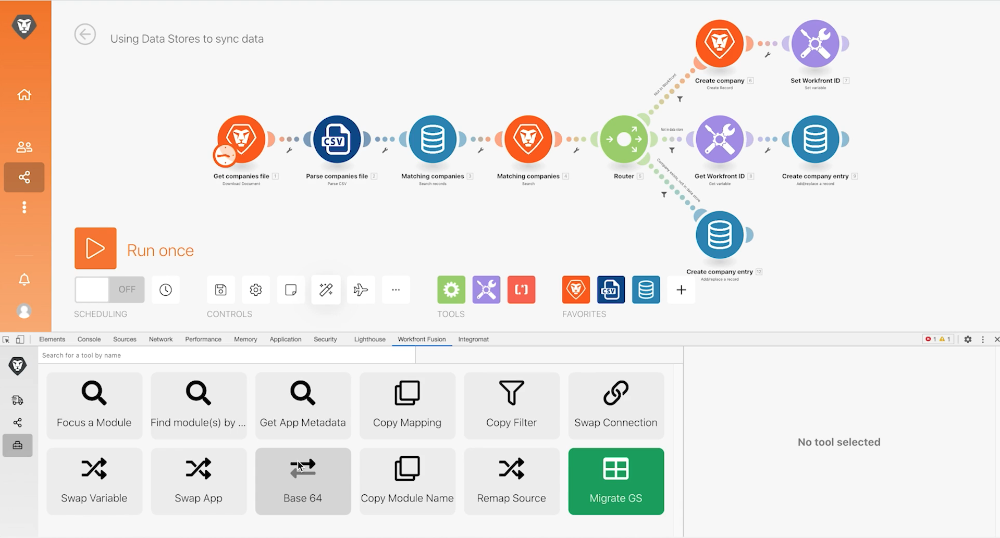

# Strumento di sviluppo

Migliora le tue capacità di risolvere i problemi di uno scenario e di semplificare le configurazioni complesse utilizzando lo strumento di sviluppo.

## Panoramica sull&#39;esercizio

Installa e utilizza le diverse aree nello strumento Workfront Dev per approfondire le richieste/risposte effettuate e i trucchi per la progettazione di scenari avanzati.

>[!NOTE]
>
>Lo strumento Workfront Fusion Dev è disponibile solo nel browser Chrome quando si utilizza il [Strumento per sviluppatori Chrome](https://developer.chrome.com/docs/devtools/).

## Passaggi da seguire

**Installare lo strumento Dev.**

1. Scaricare il documento &quot;workfront-fusion-devtool.zip&quot; presente nella cartella Fusion Experience Files nell&#39;unità di prova.
1. Estrai i file ZIP in una cartella.
1. Apri una scheda in Chrome e immetti **chrome://extensions**.
1. Attiva la modalità Sviluppatore utilizzando l&#39;interruttore in alto a destra, quindi fai clic sul pulsante &quot;Carica decompresso&quot; che appare in alto a sinistra. Seleziona la cartella contenente lo strumento Dev (in questo punto è stato decompresso).

   

1. Una volta scompattato, lo strumento Dev viene visualizzato tra le altre estensioni.

   

   **Utilizza il flusso live.**

1. Inizia aprendo lo scenario &quot;Utilizzo di Data Store per sincronizzare i dati&quot;.
1. Aprire lo strumento di sviluppo digitando F12 o la funzione F12. Oppure puoi fare clic sul menu a tre punti nella barra degli indirizzi di Chrome e passare a Strumenti di sviluppo.

   

1. Fai clic sulla scheda Workfront Fusion , quindi seleziona Live Stream dall&#39;elenco a sinistra.
1. Fai clic su Esegui una volta per visualizzare gli eventi mentre si verificano.
1. Fai clic su un evento per visualizzare le schede a destra per Intestazioni di richiesta, Corpo della richiesta, Intestazioni di risposta e Corpo della risposta.

   

   **Utilizzare il debugger di scenario**

1. Seleziona Debugger scenario e fai clic su un modulo per visualizzare informazioni sulle operazioni di tale modulo.

   

1. Passare alla scheda Cronologia. Fai clic su Dettagli su un&#39;esecuzione per esaminare i dettagli dell&#39;operazione del modulo per un&#39;esecuzione specifica.

   

   **Utilizzare gli strumenti**

1. Torna alla finestra di progettazione dello scenario e seleziona Strumenti nello strumento Sviluppo. Vengono visualizzati gli strumenti disponibili.

   

+ Attiva un modulo : trova e apri rapidamente un modulo utilizzando l’ID modulo.
+ Trova moduli tramite mappatura : cerca uno scenario utilizzando una parola chiave per trovare valori e/o chiavi mappate nei moduli.
+ Ottieni metadati app : puoi visualizzare uno scenario relativo ai metadati per l’app selezionata.
+ Copia mappatura : copia la mappatura da un modulo a un altro. È inoltre possibile clonare il modulo nella finestra di progettazione.
+ Copia filtro - Copia un filtro. Il filtro viene sempre assegnato al modulo a destra.
+ Scambia connessione - Lo strumento prende la connessione dal modulo selezionato e imposta la stessa connessione a tutti i moduli della stessa app nello scenario. È utile se è necessario modificare la connessione in uno scenario completato. Evita di perdere tutte le mappature e di risparmiare tempo utilizzando questo strumento.
+ Variabile di scambio: trova tutte le occorrenze della variabile specificata nell&#39;intero scenario o in un modulo e le sostituisce con la nuova. I caratteri jolly non sono supportati. Se hai accidentalmente mappato un valore nell’intero scenario, questo può aiutarti a facilmente cambiare il valore corretto.
+ App di scambio : consente di scambiare l’app specificata per un’altra.
+ Base 64 - Codifica i dati immessi in Base64 o decodifica Base64. Utile quando desideri cercare particolari dati nella richiesta codificata.
+ Copia nome modulo - Copia il nome del modulo selezionato negli Appunti.
+ Origine rimappatura - Modifica l&#39;origine di mappatura da un modulo a un altro. Devi innanzitutto aggiungere il modulo da utilizzare come modulo di origine alla route in uno scenario.
+ Migrazione del sistema operativo: creato appositamente per aggiornare i moduli Google Sheets (legacy) alla versione più recente di Google Sheets. Aggiunge una nuova versione del modulo subito dopo la versione precedente del modulo nel percorso dello scenario.
