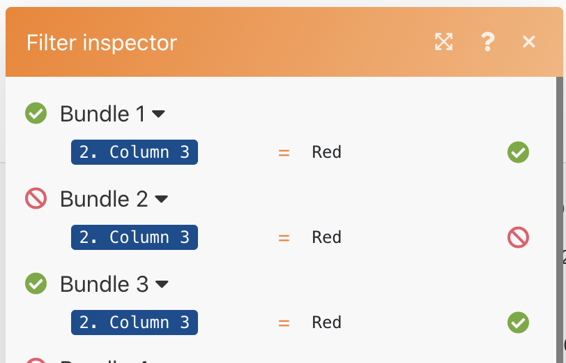
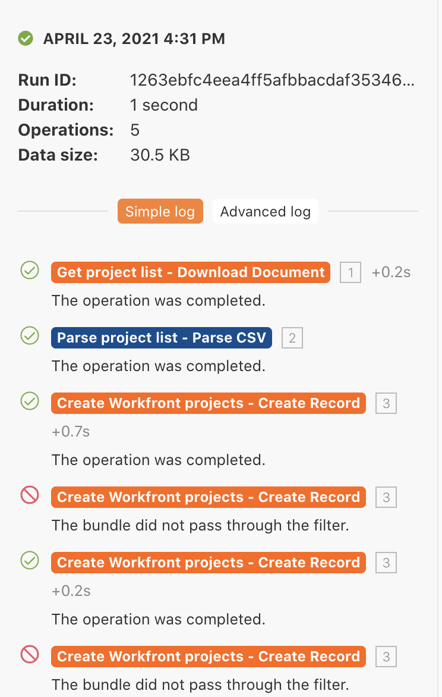

# Cronologia esecuzione

Rivedi e controlla i dettagli sulle esecuzioni passate e le configurazioni degli scenari.

## Panoramica sull&#39;esercizio

Rivedi la cronologia di esecuzione per lo scenario &quot;Utilizzo del filtro potente&quot; per comprendere cosa è successo quando si sono verificate le esecuzioni e come sono state strutturate quando sono state eseguite.

## Passaggi da seguire

1. Apri lo scenario &quot;Utilizzo del filtro di potrebbe&quot;.
1. Nella pagina della panoramica, fai clic sulla scheda Cronologia (in alto, sotto il nome dello scenario).

   

1. Trova un’esecuzione e fai clic sul pulsante dei dettagli per aprire una pagina che mostra le operazioni specifiche eseguite (o non eseguite) nel pannello di destra. Nel pannello a sinistra, puoi esaminare lo scenario come al momento dell’esecuzione.

   

1. Quando si fa clic su un modulo nel pannello dello scenario, viene visualizzato un pannello di controllo del modulo che visualizza informazioni sulle impostazioni del modulo. Fai clic sull’ispettore di esecuzione accanto a un modulo o a un filtro per vedere su quali bundle di informazioni sono stati eseguiti.

   

   

1. Nel pannello di destra, scorri attraverso o fai clic sul registro semplice per visualizzare i dettagli della &quot;riproduzione per riproduzione&quot; dell’esecuzione.

   + Puoi vedere quando le operazioni sono state completate nei moduli e quando i bundle sono passati (o non sono passati) attraverso i filtri.

   

   + Fai clic su un elemento di registro per aprire il pannello delle operazioni nel pannello dello scenario. I registri sono elencati in ordine cronologico in cui si sono verificati.

   

1. Il registro Avanzate mostra informazioni simili. Tuttavia, fornisce ulteriori informazioni sul numero di cicli eseguiti per esecuzione e consente di approfondire in quale bundle di informazioni sono state elaborate in ciascun ciclo.

