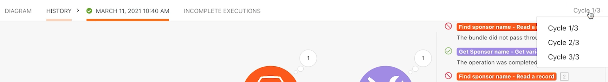

# Esercizio sull’esplorazione di esecuzioni, cicli e bundle

Comprendi il comportamento di esecuzioni, cicli e bundle utilizzando la cronologia di esecuzione di uno scenario.

## Panoramica dell’esercizio

Esercitati con diverse configurazioni di scenari per esplorare utilizzando esecuzioni e cicli.

## Passaggi da seguire

1. Clona lo scenario denominato “Sharing variables between routing paths” (Condivisione di variabili tra percorsi di routing). Assegna al nuovo scenario il nome “Sharing variables between routing paths - Cycles test” (Condivisione di variabili tra percorsi di routing - Test cicli).
1. Rimuovi il modulo Send an email (Invia un’e-mail), poiché non è necessario per questo test.

   **Configura lo scenario per elaborare 3 cicli per esecuzione. Elabora 5 progetti in ogni ciclo.**

1. Fai clic sul modulo di attivazione e modifica il campo Maximal (Massimo) in 5, in modo da elaborare solo 5 progetti in ogni ciclo.
1. Nei criteri di ricerca, rimuovi il secondo filtro che limita la ricerca a un singolo progetto.
1. Fai clic su OK.

1. Nella barra degli strumenti di Fusion, apri le impostazioni Scenario e modifica il campo Max number of cycles (Numero massimo di cicli) da 1 a 3.
1. Fai clic su OK.

   

   **Pianifica l’esecuzione dello scenario ogni minuto.**

1. Fai clic sull’icona dell’orologio dal modulo trigger e modifica il campo Minutes (Minuti) su 1 minuto.

   

1. Successivamente, premi l’interruttore Pianificazione sotto il pulsante Run once (Esegui una volta) per attivarlo. Salva lo scenario.

   

1. Vai alla Cronologia delle esecuzioni per lo scenario e osserva come viene visualizzato un nuovo record della cronologia entro il minuto successivo. Potrebbe essere necessario aggiornare la pagina.

   

1. Fai clic sul pulsante dei dettagli di un’esecuzione. Fai clic sul registro semplice nel pannello a destra, in modo simile a quanto fatto nella sezione relativa alla cronologia di esecuzione del corso di formazione su Workfront Fusion.
1. I record delle operazioni elaborate vengono suddivisi in cicli.

   

1. Un menu a discesa in alto a destra della finestra consente di selezionare ogni volta uno dei 3 cicli impostati per l’esecuzione.

   
