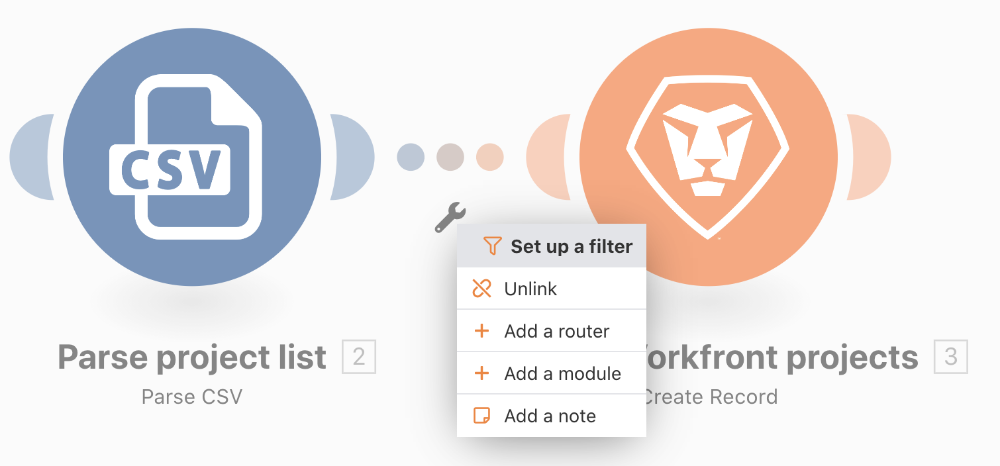

# Esercizio sui filtri

Scopri come utilizzare il filtro tra i moduli per consentire solo determinati tipi di bundle.

## Panoramica dell’esercizio

Aggiungi un filtro tra i due moduli nello scenario Oltre la mappatura di base per creare solo progetti con un colore di progetto “Rosso” nel file CSV.

## Passaggi da seguire

1. Crea un clone dello scenario “Oltre la mappatura di base” e denominalo “Utilizzo del filtro potente”.

   **Aggiungi un filtro prima del modulo Crea progetti Workfront per consentire solo la creazione di progetti rossi.**

   

1. Aggiungi un filtro facendo clic sulla linea tratteggiata che collega i moduli o facendo clic sull’icona a forma di chiave inglese e selezionando Imposta un filtro.
1. Utilizza il campo Etichetta per denominare il filtro “Solo progetti rossi”.
1. Nel campo Condizione, mappa il campo Colore progetto (colonna 3 nel file CSV). Seleziona l’operatore Uguale a (senza distinzione maiuscole/minuscole), quindi digita “rosso”.
1. Fai clic su OK.

   

   **Verifica il filtro e i risultati.**

1. Fai clic su Salva per salvare lo scenario, quindi su Esegui una volta.
1. Fai clic sul controllo di esecuzione per il filtro per vedere in che modo ogni pacchetto è stato esaminato dal filtro e ha superato o non è riuscito a passare al modulo Crea progetti di Workfront.

   

1. Trova i progetti creati nell’istanza Workfront.
