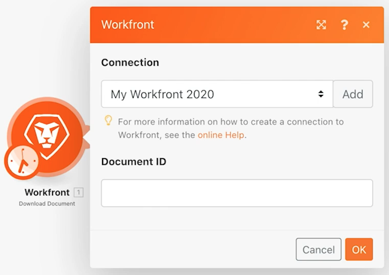
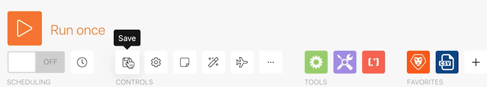

# Esercizio sulla progettazione dello scenario iniziale

Scopri alcuni suggerimenti di base per la navigazione quando accedi a Workfront Fusion per la prima volta, nonché per la creazione del primo scenario.

## Prerequisiti

1. Questo esercizio richiede un’unità di prova di Workfront. Puoi richiederne uno compilando [questo modulo](https://forms.office.com/r/f1J8HRGrNY). Se non riesci ad accedere al modulo, invia nome, indirizzo e-mail e nome dell’azienda a wfttstdr@adobe.com.
1. Gli esercizi di Fusion presuppongono che tu abbia guardato il video dettagliato corrispondente all’esercizio. In questo caso è [Procedura dettagliata sulla progettazione dello scenario iniziale](https://experienceleague.adobe.com/docs/workfront-learn/tutorials-workfront/fusion/understand-the-basics/initial-scenario-design-walkthrough.html?lang=it).

## Panoramica dell’esercizio

Crea un nuovo progetto in Workfront per ogni riga nel file CSV dell’elenco dei progetti.

## Passaggi da seguire

1. Crea una cartella nella sezione Scenario denominata “Esercizi di abilitazione di Fusion”.
1. Fai clic sulla cartella, quindi su Crea un nuovo scenario.

   

1. Nella pagina successiva, cerca Workfront e seleziona l’app. Quindi fai clic su Continua.
1. In alto a sinistra nella schermata di progettazione dello scenario, rinomina lo scenario “Progettazione scenario iniziale”
1. Fai clic sul modulo trigger vuoto al centro dello schermo e seleziona l’app Workfront, quindi seleziona il modulo Scarica documento.

   **Autentica la connessione del modulo al tuo account Workfront.**

1. Per creare una connessione per la prima volta, fai clic sul pulsante Aggiungi.

   

1. Assegna alla connessione un nome, ad esempio “Il mio Workfront 2020”

   

1. Inserisci l’URL dell’**istanza di Workfront**, quindi fai clic su Avanti.

   

1. Inserisci la password e fai clic su Accedi.

   **La connessione è stata stabilita. Immetti ora l’ID documento del documento che desideri scaricare da Workfront.**

   

1. Torna su Workfront. Nella cartella “File esercizi Fusion”, seleziona “_Fusion2020_Project List.csv” e fai clic sui dettagli del documento nel pannello a sinistra. Copia il numero ID del documento dall’indirizzo URL (questo è il primo numero lungo nell’URL).

   

1. Torna a Fusion e incolla il numero nel campo ID documento, quindi fai clic su OK.
1. È consigliato di rinominare i moduli durante la creazione. Fai clic con il pulsante destro del mouse sul modulo Workfront e scegli Rinomina. Denomina il modulo “Ottieni elenco progetti”.

   **Successivamente analizzerai il file CSV che hai appena scaricato in modo da poter accedere a ogni riga del file. Queste informazioni verranno utilizzate quando si crea un progetto da ogni riga.**

1. Fai clic sul lato destro del modulo Workfront per aggiungere un altro modulo. Cerca l’app CSV e seleziona il modulo Analizza CSV.
1. Configura l’analisi del file CSV per 6 colonne, il file CSV contiene intestazioni, seleziona il tipo di delimitatore virgola e inserisci dati nel campo CSV. Quindi fai clic su OK.

   

1. Rinomina questo modulo “Analizza elenco progetti”.
1. Nella parte inferiore della schermata di progettazione dello scenario, fai clic su Salva per salvare lo scenario.
1. Fai clic su Esegui una volta per visualizzare l’output.

   >[!NOTE]
   >
   >Ignora l’avviso che indica che un trasformatore non deve essere l’ultimo modulo (è vero, ma non è importante per questo test). Fai clic su Esegui comunque.

   

1. Apri il controllo di esecuzione sul modulo Analizza CSV per visualizzare gli input e gli output del modulo. Ci sono un pacchetto (un file CSV) come input e diversi pacchetti come output (un pacchetto per ogni riga nel file CSV). La schermata sarà simile all’immagine seguente:

   

   **Aggiungi un modulo per creare un progetto per ogni riga nel file CSV.**

1. Aggiungi un altro modulo. Seleziona l’app Workfront e scegli il modulo Crea record.
1. Imposta il Tipo record come Progetto.

   >[!TIP]
   >
   >Per trovarlo rtapidamente, inizia a digitare alcune lettere, ad esempio *proj*.

1. Quindi usa i tasti Comando/Ctrl+G per trovare Name (nome del progetto). Seleziona la casella accanto a Name (Nome); il campo viene visualizzato di seguito.
1. Ora seleziona le caselle accanto a Planned Start Date (Data di inizio pianificata) e Priority (Priorità).
1. Fai clic nel campo Name (Nome) in modo che venga visualizzato il pannello di mappatura. Fai clic sul campo Column 1 (Colonna 1) dal modulo Parse CSV (Analizza CSV) per aggiungerlo al campo Name (Nome). Questo è il nome del progetto dal file CSV.
1. Per Planned Start Date (Data di inizio pianificata), fai clic su Column 5 (Colonna 5) del modulo Parse CSV (Analisi CSV).
1. Per il campo Priority (Priorità), scegli Normal (Normale) dal menu a discesa.

   **Il pannello di mappatura si presenta simile al seguente:**

   

1. Fai clic su OK.

   >[!NOTE]
   >
   >Se non fai clic su OK e torni accidentalmente alla finestra di progettazione, il lavoro non viene salvato e dovrai eseguire nuovamente la mappatura.

1. Fai clic con il pulsante destro del mouse sul modulo Workfront e rinominalo “Crea progetti Workfront”.
1. Salva lo scenario e fai clic sul pulsante Run once (Esegui una volta).
1. Fai clic sul controllo di ispezione dell’esecuzione in alto a destra dell’ultimo modulo.

   + Vedrai che sono state eseguite 20 operazioni. Ogni operazione ha utilizzato un pacchetto, ovvero una riga, dal file CSV come input e ha generato come output un pacchetto, ovvero un progetto creato in Workfront. L’ID del progetto creato viene visualizzato con il pacchetto di output.

   

   **Utilizzo delle note**

1. Le note contribuiscono a creare maggiore visibilità nella progettazione dello scenario. Per aggiungere una nota al modulo Create Workfront projects (Crea progetti Workfront), fai clic con il pulsante destro del mouse e seleziona Aggiungi una nota. Viene visualizzato un pannello a destra della finestra di progettazione in cui puoi aggiungere una nota al modulo. Digita “Crea un progetto con nome, data di inizio pianificata e priorità mappate dal file CSV”.
1. Aggiungi un’altra nota per descrivere l’azione del modulo trigger (il primo modulo Workfront).
1. Chiudi il pannello delle note facendo clic sulla X nell’angolo in alto a destra.

   + Per accedere nuovamente alle note, fai clic sul pulsante Note nella barra degli strumenti inferiore oppure fai clic con il pulsante destro del mouse su un modulo e aggiungi una nuova nota.
   + Le note sono ordinate in ordine cronologico inverso.
   + Una volta aggiunte le note, sul pulsante Note viene visualizzato un punto arancione.

   

1. Salva lo scenario facendo clic sul pulsante Save (Salva) nella barra degli strumenti dei controlli.
1. Puoi visualizzare i progetti creati nella tua istanza di Workfront.
