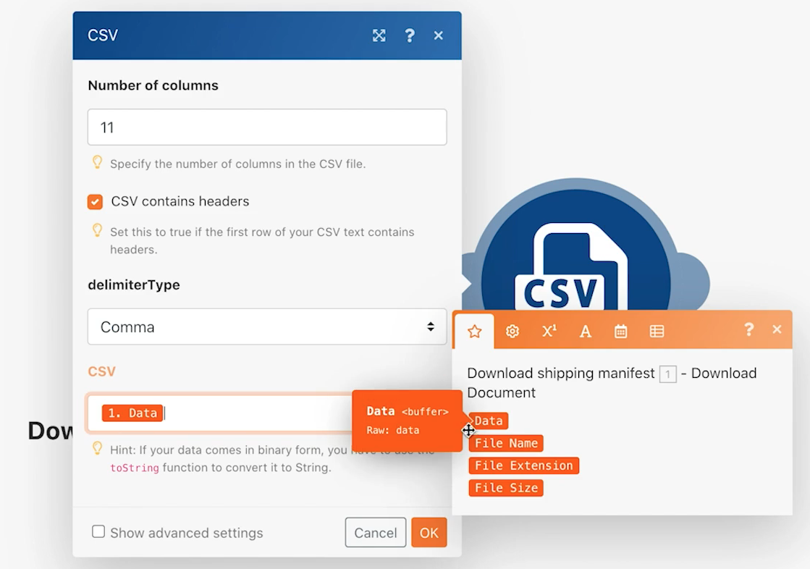

# Introduzione ai connettori universali

Approfondisci le tue conoscenze sull’utilizzo dei connettori universali REST e sull’utilizzo dei dati restituiti.

## Panoramica dell’esercizio

Utilizzando un carattere Pokemon in un foglio di calcolo, chiama l’API Poke tramite un connettore HTTP per raccogliere e pubblicare ulteriori informazioni su tale carattere.

## Passaggi da seguire

**Scarica il file CSV da Workfront.**

1. Nella cartella &quot;Fusion Exercise Files&quot; di Workfront, selezionate &quot;_Fusion2020_Shipping Manifest.csv&quot; e fate clic su Dettagli documento.
1. Copia il primo numero ID dall’indirizzo URL.
1. Crea un nuovo scenario in Workfront Fusion. Denominalo &quot;Utilizzo di connettori universali&quot;.
1. Inizia con il modulo Scarica documento dall’app Workfront.
1. Configura la connessione Workfront e includi l’ID documento copiato dall’URL di Workfront.
1. Rinomina questo modulo &quot;Scarica manifesto di spedizione&quot;.

   

   **Analizza i dati del manifesto di spedizione.**

1. Aggiungi un altro modulo, selezionando Analizza CSV.
1. Imposta l&#39;analisi CSV per 11 colonne. Seleziona la casella CSV contains headers. Scegli il tipo di delimitatore virgola e inserisci i dati del modulo Scarica documento nel campo CSV.

   

1. Rinomina questo modulo &quot;Analizza manifesto di spedizione&quot;.
1. Salva lo scenario e fai clic su Esegui una volta in modo da visualizzare i dati dal file CSV nei passaggi successivi.

   **Ottieni i dati Pokemon utilizzando il connettore universale.**

1. Aggiungi un modulo HTTP Make a Request.
1. Nel campo URL utilizza `https://pokeapi.co/api/v2/pokemon/[Character]`, dove [Carattere] è mappato alla colonna 3 dal modulo CSV di analisi.
1. Selezionare la casella di controllo Analizza risposta.
1. Selezionare Mostra impostazioni avanzate, quindi selezionare la casella accanto a &quot;Valuta tutti gli stati come errori&quot;.
1. Fai clic su OK e rinomina il modulo &quot;Ottieni informazioni Pokemon&quot;.

   **Il pannello di mappatura deve essere simile al seguente:**

   

   **In questa parte dell&#39;esercizio, desideri elaborare solo la riga 1 nel file CSV.**

1. Aggiungi un filtro prima del modulo Ottieni informazioni Pokemon. Denomina &quot;Solo riga 1&quot;.
1. Imposta la condizione per consentire il passaggio solo dell’ID numero 1. L’ID numero 1 si trova nella riga 1 e il campo ID si trova nella colonna 1 del file CSV.

   

1. Salva lo scenario.
1. Fai clic su Esegui una volta e osserva il messaggio di errore ricevuto nel modulo HTTP Crea una richiesta.

   >[!IMPORTANT]
   >
   >Nel campo URL dati di input il nome del carattere è scritto in maiuscolo. Questa operazione non funziona per effettuare quella chiamata API perché i nomi dei caratteri devono essere minuscoli.

   

1. Utilizza il pannello di mappatura nel campo HTTP Crea un URL di richiesta per creare [Carattere] inserire tutte le lettere minuscole utilizzando **lower** funzione.

   

   **Mappa le informazioni dall’API utilizzando il modulo Imposta più variabili.**

1. Aggiungi il modulo Set multiple variables dopo Get Pokemon info (Imposta più variabili). Nome mappa, altezza, peso e capacità.
1. Poiché il campo Abilità è un array, ricorda di utilizzare la funzione di mappatura per accedere al nome di ogni abilità nell’array.

   

   **Esegui lo scenario senza il filtro per individuare un altro errore.**

1. Per elaborare tutte le righe del file CSV, elimina il filtro Solo riga 1:

   + Fai clic sull’icona del filtro per modificarlo.
   + Elimina l’etichetta del filtro.
   + Elimina la condizione.
   + Fare clic su OK.

1. Salva lo scenario e fai clic su Esegui una volta.
1. Si è verificato un errore nel modulo di recupero informazioni Pokemon. Vedete che un personaggio supereroe è stato passato all&#39;API di Pokemon.

   >[!NOTE]
   >
   >Nella procedura dettagliata Router verrà illustrato come risolvere questo errore creando un percorso separato per l&#39;elaborazione dei supereroi.

   
