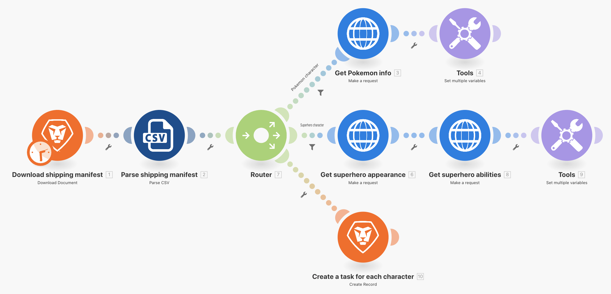

# Router

Comprendere l&#39;importanza dei router e come utilizzarli per elaborare in modo condizionale i diversi moduli.

## Panoramica dell’esercizio

Utilizza un router per passare i bundle Pokemon e supereroi lungo il percorso corretto, quindi crea un’attività per ogni carattere.

## Passaggi da seguire

1. Clona lo scenario Utilizzo di connettori universali dell’esercizio precedente. Denominarlo &quot;Creazione di percorsi diversi utilizzando i router&quot;.

   **Create un nuovo percorso per i supereroi clonando i moduli e aggiungendo un router.**

   

1. Fai clic con il pulsante destro del mouse sul modulo di informazioni Get Pokemon e scegli Clone. Una volta clonato, trascinalo e collegalo alla linea tra il nuovo modulo HTTP e il modulo CSV di analisi.

   >[!NOTE]
   >
   > Notate come aggiunge automaticamente un router con due percorsi.

1. Denomina questo modulo &quot;Ottieni l&#39;aspetto di un supereroe&quot;.
1. Clonate questo modulo, spostate il clone a destra e denominatelo &quot;Get superhero abilities&quot; (Ottieni abilità da supereroe).
1. Clonare il modulo Strumenti e spostarlo alla fine del secondo percorso.
1. Fai clic sull’icona della bacchetta, il pulsante Allineamento automatico, nella barra degli strumenti.

   **Lo scenario dovrebbe essere simile al seguente:**

   

   **Ora modificherai i valori mappati nei nuovi moduli clonati.**

1. Vai a <https://www.superheroapi.com/> e utilizza il tuo account Facebook per ottenere un token di accesso.

   >[!NOTE]
   >
   >Se hai problemi ad accedere al tuo token superhero, puoi utilizzare questo token condiviso: 10110256647253588. Tieni presente quante volte richiami l’API dei supereroi in modo che questo token condiviso continui a funzionare per tutti.

1. Apri le impostazioni per l’aspetto Get superhero e modifica l’URL in `https://www.superheroapi.com/api/[access- token]/332/appearance`. Assicurati di includere il token di accesso nell’URL. Fare clic su OK.
1. Apri le impostazioni per le abilità Get superhero e modifica l’URL in `https://www.superheroapi.com/api/[access- token]/332/powerstats`. Assicurati di includere il token di accesso nell’URL. Fare clic su OK.
1. Fate clic con il pulsante destro del mouse su ciascun modulo superhero e selezionate Esegui solo questo modulo. Verrà generata la struttura dati necessaria per la mappatura.
1. Dopo aver eseguito entrambe, modifica il numero &quot;332&quot; in ciascun campo URL in Colonna 4 mappata dal modulo CSV di analisi.

   

   **Ora puoi fare clic sul modulo Imposta più variabili nel percorso del supereroe e aggiornare il nome, l&#39;altezza, il peso e le abilità.**

1. Aggiornare i campi Nome e Abilità dal modulo Ottieni abilità supereroistiche (Modulo 8).

   

1. Aggiornate i campi Altezza (Height) e Spessore (Weight) dal modulo di aspetto Get superhero (Modulo 6).

   

   **Al termine dell&#39;operazione, le variabili dovrebbero avere questo aspetto. I numeri dei moduli vengono visualizzati nei valori dei campi.**

   

1. Fare clic su OK, quindi salvare lo scenario.

   **Crea un altro percorso per creare un&#39;attività per carattere.**

1. In Workfront, crea un progetto vuoto. Denomina il progetto &quot;Shipping Manifest Project&quot; (Manifesto spedizione) e copia l&#39;ID progetto dall&#39;URL.
1. Tornare a Workfront Fusion e fare clic al centro del router per creare un altro percorso.

   

1. Fai clic su al centro del modulo vuoto visualizzato e aggiungi un modulo Crea record dall’app Workfront.
1. Impostare Tipo record su Attività e selezionare ID progetto dalla sezione Campi da mappare.
1. Incolla l’ID progetto copiato da Workfront nel campo ID progetto.
1. Selezionare ora il campo Nome dalla sezione Campi da mappare.
1. Denomina l’attività &quot;[Carattere] da [Affiliazione],&quot; prendendo il nome del carattere e il nome del franchise dal file CSV. La colonna 3 è il nome del carattere e la colonna 2 è il nome del franchise.

   

1. Fare clic su OK e rinominare il modulo in &quot;Crea un&#39;operazione per ogni carattere&quot;.

   **Aggiungi i filtri in modo che lo scenario possa essere eseguito senza errori. Desideri che solo i personaggi Pokemon percorrano il percorso principale, solo i personaggi supereroi percorrano il percorso centrale e tutti i personaggi percorrano il percorso inferiore.**

1. Per creare il primo filtro, fai clic sulla linea punteggiata a sinistra del modulo di informazioni Get Pokemon. Denominalo &quot;Pokemon character&quot;.
1. Per la condizione, consenti solo i record in cui il franchise (Colonna 2) è uguale a &quot;Pokemon&quot;. Scegliere l&#39;operatore di testo &quot;Uguale a&quot;.
1. Fate clic sulla linea tratteggiata a sinistra del modulo di visualizzazione Recupera supereroe per creare il filtro successivo. Chiamalo &quot;personaggio supereroe&quot;.
1. Poiché i supereroi possono provenire da vari franchise, usare il campo ID supereroe (Colonna 4) per determinare se un personaggio è un supereroe o meno.

   **I filtri dovrebbero essere simili al seguente:**

   

   

1. Salva lo scenario e fai clic su Esegui una volta. Utilizzare i controlli di esecuzione per verificare che tutte le operazioni siano state completate e controllare le attività create nel progetto Workfront.

   
