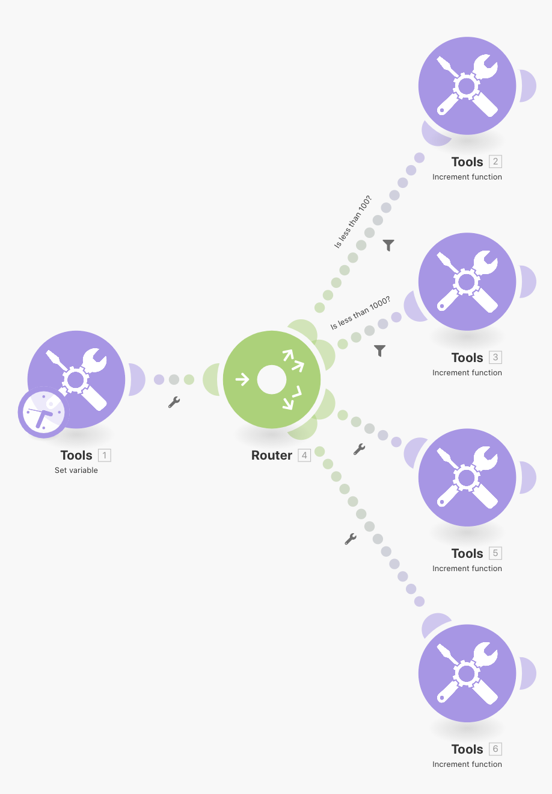
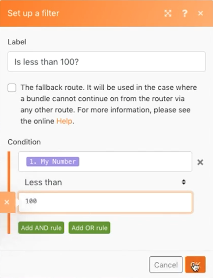

# Esercizio sui modelli di indirizzamento

Rafforza il concetto di instradamento e percorso di fallback senza dover gestire altre API.

## Panoramica dell’esercizio

Utilizza il modulo Imposta variabile per inviare un numero attraverso più percorsi e vedere come si comportano i filtri e i fallback durante l’indirizzamento.

## Passaggi da seguire

1. Crea un nuovo scenario e chiamalo “Pattern di instradamento e fallback”.
1. Per il trigger, aggiungi il modulo dello strumento Set Variable (Imposta variabile). Inserisci “Il mio numero” come nome della variabile, lascia la durata della variabile impostata su un ciclo e imposta il valore della variabile su “75”.

   

1. Aggiungi un altro modulo e scegli il modulo Router (Instradamento). Per entrambi i percorsi, seleziona lo strumento Increment function (Funzione incremento) e fai clic su OK senza apportare alcuna modifica per ciascuno di essi.

   + Per il primo percorso, crea un filtro, chiamalo “Meno di 100” e imposta la condizione su [Il mio numero] Less than (Meno di) 100.

   + Per il secondo percorso, crea un filtro, chiamalo “Meno di 1000” e imposta la condizione su [Il mio numero] Less than (Meno di) 1000. Assicurati di utilizzare l’operatore numerico per entrambi.

   

   

1. Fai clic su Run once (Esegui una volta) e osserva il bundle passare lungo il percorso “Meno di 100”.
1. Quindi modifica il campo del modulo Set Variable (Imposta variabile) su 950 e seleziona di nuovo Run once (Esegui una volta). Guarda come scorre lungo il secondo percorso.
1. Fai clic sul router e aggiungi un altro percorso. Aggiungi il modulo dello strumento Increment function (Funzione incremento). Per il filtro, fai clic sulla casella di controllo “The fallback route” (Il percorso di fallback). Osserva come la freccia che punta a quel percorso cambia in un punto di inserimento, indicando che si tratta del percorso di fallback.

   

1. Modifica il numero della variabile Imposta su 9500 ed Esegui una volta. Poiché il numero non è inferiore a 100 o a 1000, il bundle viaggia lungo il percorso di fallback.

Se aggiungi un altro percorso con un modulo dello strumento Funzione incremento, ma non imposti alcun filtro, cosa accadrà quando fai clic su Esegui una volta? Un bundle passerà mai lungo il percorso di fallback con il quarto percorso aggiunto?

+ No, perché senza filtro impostato, ogni bundle seguirà sempre questo percorso invece del percorso di fallback.
