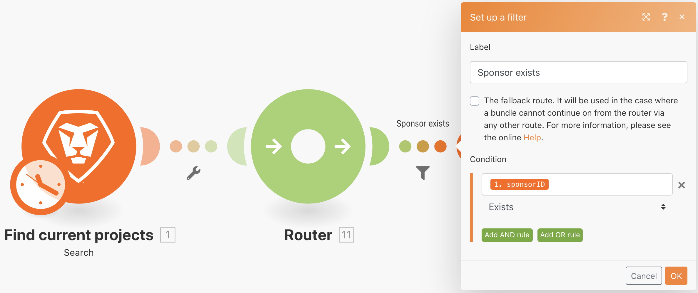

# Imposta/Recupera variabili

Scopri come utilizzare i moduli Imposta e Ottieni variabile per utilizzare i campi disponibili in un percorso diverso.

## Panoramica dell’esercizio

Cerca informazioni su un progetto in Workfront e invia un’e-mail con le informazioni correlate.

## Passaggi da seguire

1. Crea un nuovo scenario e denominalo &quot;Condivisione di variabili tra percorsi di routing&quot;.
1. Per il trigger, seleziona il modulo di ricerca nell’app Workfront.

   + Impostare Tipo record su Progetto.
   + Per il set di risultati, scegliere Tutti i record corrispondenti.
   + Per i criteri di ricerca, impostarlo su Stato uguale a CUR.
   + Per Output, scegliete ID, Nome, Descrizione e ID sponsor.

   

   

1. Fare clic su OK e rinominare il modulo &quot;Trova progetti correnti&quot;.
1. Aggiungi un altro modulo e seleziona Workfront Read a record module (Leggi un modulo di record).

   + In Tipo di record scegliere Utente.
   + In Output scegliere Nome.
   + Mappa l’ID sponsor dal modulo di ricerca al campo ID.

1. Fare clic su OK.
1. Rinomina il modulo &quot;Trova nome sponsor&quot;.

   

1. Salva lo scenario e fai clic su Esegui una volta.

   Se ricevi un errore nel modulo Leggi un record, è probabile che il modulo di ricerca trovi un progetto senza uno sponsor elencato.

   **Per evitare questo errore, crea due percorsi: uno per i progetti che hanno un ID sponsor e uno per i progetti che non lo hanno.**

1. Aggiungere un router tra i due moduli facendo clic sull&#39;icona a forma di chiave inglese tra il router e il modulo Read a record. Imposta un filtro denominato &quot;Lo sponsor esiste&quot; e imposta la condizione su &quot;L’ID sponsor esiste&quot;.

   

1. Fare clic sul router per creare un altro percorso. Aggiungi un modulo Invia un messaggio e-mail dall’app E-mail.

   + Inserisci il tuo indirizzo e-mail nel campo A.
   + Nel campo Oggetto digitare &quot;Informazioni sul progetto corrente&quot;.
   + Nel campo Contenuto, inserisci il nome del progetto, la descrizione e lo sponsor.
   + Non è possibile estrarre l’output del nome dello sponsor dal modulo Read a record. È possibile accedere all&#39;ID sponsor solo dal modulo di ricerca prima del router. È necessario trovare un modo per accedere al nome dello sponsor dall&#39;altro percorso del router.

   

1. Fare clic su OK per ora e rinominare il modulo &quot;Send project info&quot;

   **Utilizza Set/Get variables per condividere i dati tra percorsi diversi.**

1. Dopo il modulo Trova nome sponsor, aggiungi un modulo strumento Imposta variabile.

   + Inserisci &quot;Nome sponsor&quot; come nome della variabile.
   + Lascia la durata della variabile su Un ciclo.
   + Mappa il campo all’output del nome dal modulo Trova nome sponsor.

1. Fare clic su OK, quindi rinominare il modulo &quot;Set Sponsor name&quot; (Imposta nome sponsor).

   

1. Quindi, fai clic con il pulsante destro del mouse tra il router e il modulo Send an email (Invia un’e-mail) per aggiungere un modulo dello strumento Get variable (Ottieni variabile). Immetti &quot;Nome sponsor&quot; nel campo Nome variabile.
1. Fare clic su OK. Rinomina il modulo &quot;Ottieni nome sponsor&quot;.

   

1. Torna al modulo Invia un’e-mail e mappa il valore dal modulo Ottieni nome sponsor nel campo del contenuto. Fare clic su OK.

   

   >[!IMPORTANT]
   >
   >Prima di testare lo scenario, ti consigliamo di limitare il numero di progetti elaborati per evitare di ricevere un’ondata di e-mail.

1. Vai alla tua Workfront test drive e individua il progetto Northstar Fashion Exhibitors Booth. Questo è un progetto corrente che ha uno sponsor. Copia l’ID del progetto dall’URL.

   

1. Nel tuo scenario, fai clic sul modulo Trova progetti correnti. Aggiungi un’altra condizione ai criteri di ricerca facendo clic sul pulsante verde &quot;Aggiungi regola AND&quot;. Specifica che l&#39;ID deve essere uguale all&#39;ID progetto copiato. Fare clic su OK.
1. Salva lo scenario e fai clic su Esegui una volta.
1. Esaminare i controlli di esecuzione e l&#39;e-mail ricevuta.

   
