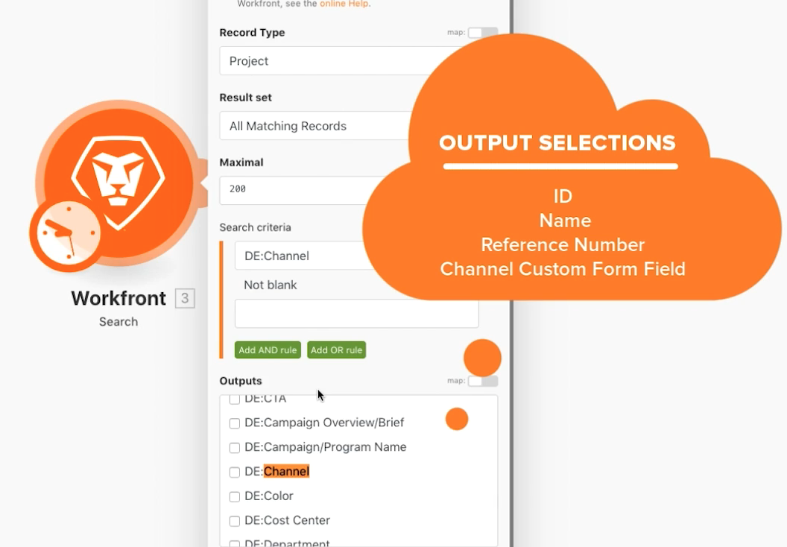

# Modulo di commutazione

Comprendere come utilizzare il modulo Switch quando è necessario eseguire trasformazioni di dati più complesse o dinamiche.

## Panoramica sull&#39;esercizio

Cerca progetti di direct mailing nell’unità di test, quindi modifica il nome di ciascun progetto in base a un valore selezionato in un campo personalizzato allegato al progetto.

## Passaggi da seguire

1. Creare un nuovo scenario e denominarlo &quot;Utilizzo del modulo Switch&quot;.
1. Per il modulo trigger, utilizza il modulo Workfront Search.
1. Imposta la connessione Workfront e il tipo di record su Progetto.
1. Nei criteri di ricerca, specifica che desideri visualizzare solo i progetti con un valore nel campo personalizzato Canale .
1. Per gli output, selezionare ID, Nome, Numero di riferimento e il campo personalizzato Canale.

   

1. Aggiungi il modulo Switch da Strumenti.
1. Per il campo Input, mappare il campo personalizzato Canale dal modulo Search.

   

1. Aggiungi quindi i casi per ogni possibile valore proveniente dal campo personalizzato Canale . Il valore possibile si trova nel campo Pattern. Si desidera che il campo di output includa un codice a 3 lettere specifico seguito dal numero di riferimento del progetto, quindi dal nome del progetto.

   **Il pannello di mappatura deve essere simile al seguente:**

   

1. Puoi aggiungere quanti casi aggiuntivi desideri. Osserva il campo Else nella parte inferiore. Questo viene utilizzato se il valore specificato non corrisponde a nessuno dei casi.

   **Aggiorna il nome del progetto in Workfront.**

   

1. Aggiungi un modulo Workfront Update Record.
1. Nel campo ID , mappa l’ID dal modulo trigger.
1. Imposta il tipo di record su Progetto.
1. Selezionare il campo Nome dalla sezione Seleziona campi da mappare e mapparlo all’output dal modulo Switch.
1. Salva lo scenario ed Esegui una volta. Visualizza i nomi di progetto aggiornati nell&#39;unità di test.
