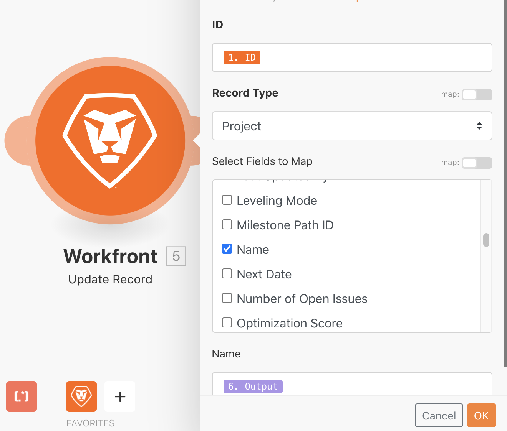

# Esercizio del modulo Switch

Scopri come utilizzare il modulo Switch quando devi eseguire trasformazioni di dati più complesse o dinamiche.

## Panoramica dell’esercizio

Cerca i progetti di direct mailing nell’unità di test, quindi modifica il nome di ciascun progetto in base a un valore selezionato in un campo personalizzato allegato al progetto.

## Passaggi da seguire

1. Crea un nuovo scenario e denominalo “Utilizzo del modulo Switch”.
1. Per il modulo trigger, utilizza il modulo Workfront Search.
1. Imposta la connessione Workfront e imposta il tipo di record su Progetto.
1. Nei criteri di ricerca, specifica che desideri visualizzare solo i progetti con un valore nel campo personalizzato Canale.
1. Per gli output, seleziona ID, Nome, Numero di riferimento e il campo personalizzato Canale.

   

1. Aggiungi il modulo Switch da Strumenti.
1. Per il campo Input, mappa il campo personalizzato Canale dal modulo di ricerca.

   

1. Quindi aggiungi dei casi per ogni possibile valore proveniente dal campo personalizzato Canale. Il valore possibile viene inserito nel campo Pattern. Il campo di output deve includere un codice di 3 lettere specifico seguito dal numero di riferimento del progetto e quindi dal nome del progetto.

   **Il pannello di mappatura si presenta simile al seguente:**

   

1. Puoi aggiungere tutti i casi aggiuntivi che desideri. Osserva il campo Else in basso. Verrà utilizzato se il valore specificato non corrisponde a nessuno dei casi.

   **Aggiorna il nome del progetto in Workfront.**

   

1. Aggiungi un modulo Workfront Update Record.
1. Nel campo ID, mappalo con l’ID dal modulo trigger.
1. Imposta il Tipo record su Progetto.
1. Seleziona il campo Nome dalla sezione Select Fields to Map (Seleziona campi da mappare) e associalo all’output del modulo Switch.
1. Salva lo scenario ed esegui una volta. Visualizza i nomi dei progetti aggiornati nell’unità di test.
