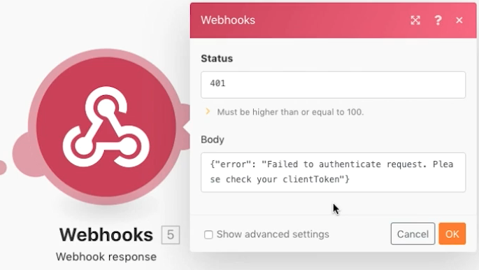

# Webhook

Scopri come creare, attivare e gestire scenari avviati da webhook.

## Panoramica sull&#39;esercizio

Lo scopo di questo scenario è quello di creare un&#39;app da vendere ai minimarket in modo che possano facilmente determinare se un cliente è abbastanza grande o meno per acquistare alcol. Il cassiere deve semplicemente inserire il nome e la data di nascita del cliente in un URL che è stato fornito. Quel post attiverà lo scenario che calcolerà la risposta e la restituirà al richiedente.

1. Lo scenario è costituito da tre webhook.
1. Il modulo trigger è un webhook personalizzato che ascolta un post.
1. Quando riceve un post, lo invia a uno dei moduli successivi.
1. Il modulo successivo restituisce una risposta al richiedente.

   

## Passaggi da seguire

**Imposta il webhook del trigger.**

1. Crea un nuovo scenario e denominalo &quot;Utilizzo dei webhook&quot;.
1. Per il trigger, aggiungi il modulo webhook personalizzato dall’app Webhooks.
1. Fai clic su Aggiungi per creare un nuovo Webhook.
1. Inserisci il nome Webhook di &quot;App per l&#39;età di bere&quot;.
1. Lascia vuote le restrizioni IP, il che significa che chiunque può inviare dati al suo interno.
1. Fai clic su Salva.

   

1. Nel pannello di mappatura dei webhook è stato creato un URL per questo webhook specifico. Fai clic su &quot;Copia indirizzo negli Appunti&quot; per copiare tale URL.
1. Fate clic su OK.
1. Fai clic su Esegui una volta.
1. Utilizza l’URL in Postman per inviare un nome e una data di nascita al tuo webhook personalizzato. Per istruzioni sulla configurazione di Postman, consulta la [Procedura dettagliata sui webhook](https://experienceleague.adobe.com/docs/workfront-learn/tutorials-workfront/fusion/beyond-basic-modules/webhooks-walkthrough.html?lang=en) esercitazione.

   **Il pannello del modulo Ganci web dovrebbe essere simile al seguente:**

   

   **Il webhook si trova ora in uno stato in cui ascolta i dati per determinare la struttura dei dati.**

1. È possibile definire la struttura dati del payload che si prevede di ottenere (le strutture dati verranno discusse in seguito). Se non si definisce una struttura dati, la struttura dati verrà determinata automaticamente quando il post viene inviato.
1. Sul lato Postman da inviare all’URL copiato. Il post deve includere i dati del modulo di base. Per questo esempio sono necessari tre campi: Nome, Data di nascita e clientToken.

   

1. Dopo aver fatto clic su Invia da Postman si dovrebbe ottenere un&#39;indicazione che il post è stato accettato.
1. Questo è il punto in cui lo scenario mostra che la struttura dati è stata determinata correttamente.
1. È possibile vedere che i dati sono stati ricevuti aprendo il controllo di esecuzione.

   

   **Imposta il routing per i token client.**

1. Aggiungi un router al modulo trigger.
1. Nel percorso superiore, aggiungi un modulo di risposta Webhook. Questo sarà il nostro percorso per quando il token client non corrisponde.
1. Imposta lo stato su 401.
1. Imposta il corpo su {&quot;error&quot;: &quot;Impossibile autenticare la richiesta. Controlla il tuo clientToken&quot;}.

   

1. Crea un filtro tra il router e il modulo di risposta Webhook. Denomina &quot;Il token client non corrisponde&quot;.
1. Per la condizione, utilizza il campo clientToken dal modulo trigger e fai un confronto numerico &quot;Diverso da&quot; con il numero 5121933.

   

1. Nel percorso in basso, aggiungi un altro modulo di risposta Webhook. Questo sarà il nostro percorso per quando il token client non corrisponde.
1. Imposta lo stato su 200.
1. Nella configurazione del corpo, utilizza le funzioni del pannello di mappatura per verificare se la persona ha 21 anni o più. Se lo sono, tornare &quot;Sei abbastanza grande da bere!&quot;, altrimenti tornare &quot;Sei fuori fortuna...&quot;

   

1. Crea un filtro tra il router e il modulo di risposta Webhook sul percorso inferiore. Denomina &quot;Il token client corrisponde&quot;.
1. Per la condizione, utilizza il campo clientToken dal modulo trigger e fai un confronto numerico &quot;Uguale a&quot; con il numero 5121933.

   

1. Fai clic sul pulsante Pianificazione in Esegui una volta per attivare lo scenario in modo che ogni volta che un nuovo post verrà ricevuto, scegli uno dei percorsi e genera una risposta.
