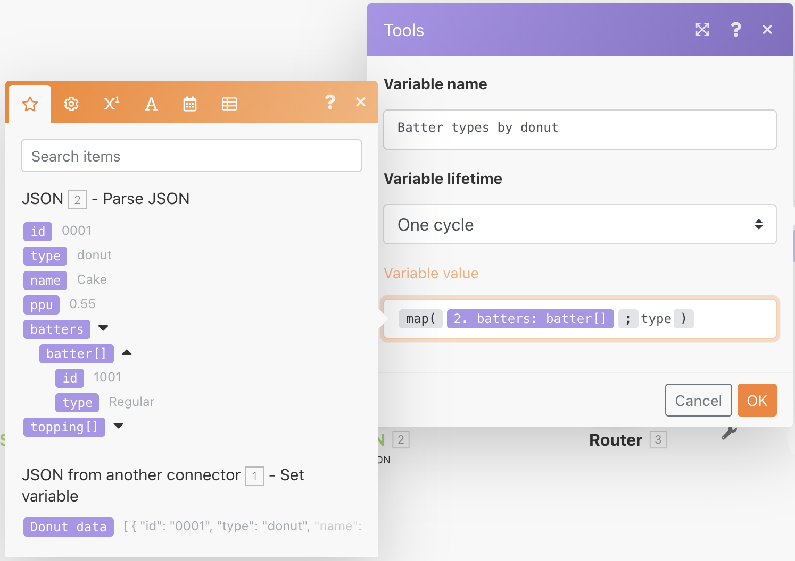

# Esercizio sull’utilizzo di file JSON

Scopri come creare e analizzare file JSON all’interno di uno scenario per supportare le tue esigenze di progettazione.

## Panoramica dell’esercizio

Lo scopo di questo esercizio è mostrare concettualmente come utilizzare le informazioni inviate in uno scenario in formato JSON, analizzandole in campi ed elementi che è possibile mappare in tutto lo scenario. Puoi quindi acquisire informazioni da tali array mappati oppure aggregarle in file JSON per poi inviarle a un altro sistema che prevede file JSON come input di ricezione.

## Passaggi da seguire

**Crea una struttura di dati e analizza il file JSON.**

1. Crea un nuovo scenario e denominalo “Utilizzo dei dati JSON per ciambella”.
1. Per il modulo trigger, utilizza il modulo Imposta variabile.
1. Per il nome Variabile, digita in “Dati per ciambella”.
1. Per il valore Variabile, copia e incolla il contenuto del documento “_Donut Data - Sample JSON.rtf” che si trova nella cartella Fusion Exercise Files (File di esercizio di Fusion) nell’unità di test.

   

1. Rinomina questo modulo “JSON da un altro connettore”.
1. Aggiungi un modulo JSON di analisi.
1. Fai clic su Aggiungi per il campo Struttura dati.
1. Seleziona il Generatore e incolla i Dati per ciambella: dati JSON campione copiati nel campo Dati campione.

   

1. Fai clic su Salva, denominando la struttura “Dati per ciambella”. Quindi fai clic su Salva.
1. Mappa i dati per ciambella dal modulo Imposta variabile al campo stringa JSON.

   

1. Salva lo scenario, quindi fai clic su Esegui una volta per visualizzare l’output.

   **L’output del modulo JSON di analisi deve essere simile al seguente:**

   

   **Mappa su variabili di array specifiche.**

1. Aggiungi un router dopo il modulo JSON di analisi.
1. Nel percorso principale, aggiungi un modulo Imposta variabile.
1. Per il nome della variabile, digita “Tipi di impasto per ciambella”.
1. Per il valore Variabile, utilizza la funzione di mappatura per ottenere i tipi di impasto dall’array impasti.

   

1. Fai clic su OK, quindi su Esegui una volta.
1. Apri il controllo di esecuzione per visualizzare il bundle di output per ciascuna delle tre operazioni, mostrando i tipi di impasto per ciascuna.

   

   **Aggrega i dati dello scenario in JSON.**

1. Nel percorso di routing inferiore, aggiungi un Aggrega al modulo JSON.
1. Per il modulo di origine, scegli l’iteratore: il modulo JSON di analisi.
1. Per la Struttura dati, crea o scegli una struttura dati qualsiasi. Per questo esempio, utilizza i dati della ciambella.
1. Procedi e mappa direttamente i campi per questo esempio, come mostrato di seguito.
1. Quando si arriva all’impasto e al topping, nota che questi sono array, quindi fai clic su Aggiungi elemento per mapparli.

   

1. Salva lo scenario e fai clic su Esegui una volta.

Osserva il controllo di esecuzione per l’opzione Aggrega al modulo JSON e nota come sei riuscito ad aggregare tre bundle in un’unica stringa JSON. Puoi quindi inviare questa stringa ad altri sistemi che prevedono JSON.

