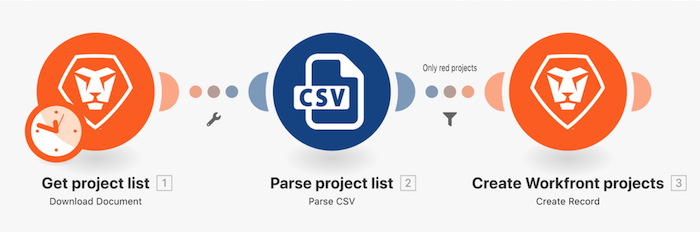

# Procedura dettagliata sui filtri

Utilizzando l’esercizio della procedura dettagliata “Oltre la mappatura di base” creato in precedenza, aggiungi un filtro tra i due moduli nei moduli per creare solo progetti con un colore di progetto “Rosso” nell’Elenco progetti.

## Procedura dettagliata sui filtri

Workfront consiglia di guardare il video della procedura dettagliata relativa all’esercizio, prima di provare a ricrearlo nel proprio ambiente.

In questo video scoprirai come:

* Aggiungere un filtro tra i due moduli nei moduli

>[!VIDEO](https://video.tv.adobe.com/v/335266/?quality=12&learn=on&enablevpops=1)

## Tocca a te

>[!NOTE]
>
>Gli esercizi pratici e le sfide sono facoltativi e non necessari per completare la formazione su Fusion.

Questa esercitazione si basa su quanto appreso nella procedura dettagliata, ma è priva di soluzione.

Modifica il filtro creato durante la procedura dettagliata dei filtri per consentire solo i progetti “gialli” con un livello di affidabilità inferiore a 100 o il cui nome contiene la parola “fase” e la data di inizio pianificata è il 2021. Denomina il filtro “Esercitazione filtro”.

**Sfida:** prova a creare un filtro che consenta solo la trasmissione di progetti con un livello di affidabilità pari. Hai bisogno di un suggerimento? Osserva le formule matematiche.

## Desideri ulteriori informazioni? Consigliamo quanto segue:

[Documentazione di Workfront Fusion](https://experienceleague.adobe.com/it/docs/workfront-fusion/using/get-started-with-fusion/understand-workfront-fusion/workfront-fusion-overview)
