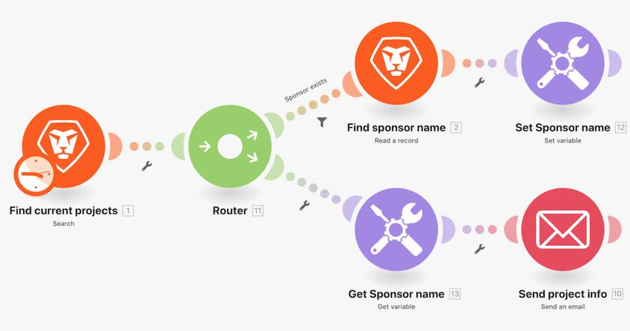

# Procedura dettagliata per le variabili Set e Get

Cerca informazioni su un progetto in Workfront e invia un’e-mail con le informazioni correlate.

## Procedura dettagliata per le variabili Set e Get

Workfront consiglia di guardare il video della procedura dettagliata relativa all’esercizio, prima di provare a ricrearlo nel proprio ambiente.

>[!VIDEO](https://video.tv.adobe.com/v/335276/?quality=12&learn=on&enablevpops=1)

## Tocca a te

>[!NOTE]
>
>Gli esercizi pratici e le sfide sono facoltativi e non necessari per completare la formazione su Fusion.

Questa esercitazione si basa su quanto appreso nella procedura dettagliata, ma è priva di soluzione.

Crea un clone dello scenario “Condivisione di variabili tra percorsi di indirizzamento” creato in questa procedura dettagliata. Invia tramite e-mail il messaggio che hai composto al proprietario del progetto e allo sponsor del progetto. Nel messaggio, vuoi anche includere la condizione del progetto. (Per il momento, è possibile che la condizione venga visualizzata come una chiave di due lettere.)

**Sfida:** pianifica il tuo scenario per inviare questa “e-mail” ogni settimana alle 8:00 di lunedì.

## Desideri ulteriori informazioni? Consigliamo quanto segue:

[Documentazione di Workfront Fusion](https://experienceleague.adobe.com/it/docs/workfront-fusion/using/get-started-with-fusion/understand-workfront-fusion/workfront-fusion-overview)
