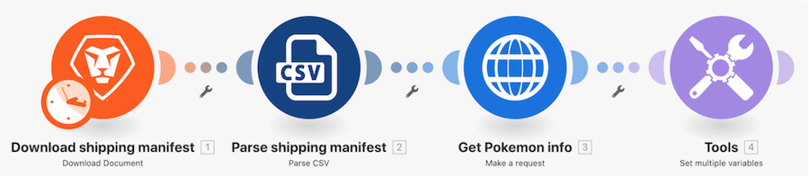

# Introduzione alla procedura dettagliata sui connettori universali

## Panoramica

Utilizzando un carattere Pokemon in un foglio di calcolo, richiama l’API Poke tramite un connettore HTTP per raccogliere e pubblicare ulteriori informazioni su tale carattere.

## Introduzione alla procedura dettagliata sui connettori universali

Workfront consiglia di guardare il video della procedura dettagliata relativa all’esercizio, prima di provare a ricrearlo nel proprio ambiente.

>[!VIDEO](https://video.tv.adobe.com/v/3416560/?captions=ita&quality=12&learn=on&enablevpops=1)

### URL di esercizio

Sito web API di Pokemon: `https://pokeapi.co/`

URL di esercizio: `https://pokeapi.co/api/v2/pokemon/{Character}`

## Desideri ulteriori informazioni? Consigliamo quanto segue:

[Documentazione di Workfront Fusion](https://experienceleague.adobe.com/it/docs/workfront-fusion/using/get-started-with-fusion/understand-workfront-fusion/workfront-fusion-overview)
