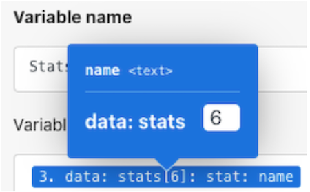

# Procedura dettagliata sui router

## Panoramica

Utilizza un router per passare i bundle Pokemon e supereroi lungo il percorso corretto, quindi crea un’attività per ogni carattere.

## Procedura dettagliata sui router

Workfront consiglia di guardare il video con procedura dettagliata dell’esercizio prima di tentare di ricrearlo nel tuo ambiente.

>[!VIDEO](https://video.tv.adobe.com/v/335272/?quality=12)

## URL di esercizio

* Sito Web API di Superhero: `https://www.superheroapi.com/`
* Primo URL per l&#39;esercizio: `https://www.superheroapi.com/api/{access-token}/{character-id}/appearance`
* Secondo URL per l&#39;esercizio: `https://www.superheroapi.com/api/{access-token}/{character-id}/powerstats`

Se hai problemi ad accedere al tuo token superhero, puoi utilizzare questo token condiviso: 10110256647253588. Tieni presente quante volte richiami l’API dei supereroi in modo che questo token condiviso continui a funzionare per tutti.

>[!TIP]
>
>Per istruzioni dettagliate sul completamento della procedura dettagliata, vedere [Procedura dettagliata sui router](https://experienceleague.adobe.com/docs/workfront-learn/tutorials-workfront/fusion/exercises/routers.html?lang=en) esercizio fisico.

## Cerca elementi nel pannello di mappatura

Il campo Cerca elementi nella parte superiore dei pannelli di mappatura consente di trovare rapidamente i campi nel pannello, anche se sono nidificati in array. La ricerca non distingue tra maiuscole e minuscole.

## Suggerimenti per lavorare con le API

Fino a questo punto, hai lavorato con un’API molto semplice (Application Programming Interface) che non richiede alcuna autenticazione aggiuntiva per richiamare le informazioni necessarie nello scenario. Di seguito sono riportati alcuni suggerimenti per aiutarti a navigare nell’utilizzo delle API e dei connettori universali.

## Passaggio 1: determinare il tipo di API

Workfront e molti sistemi software sono costruiti utilizzando un’API REST (Representative State Transfer), il tipo di API più semplice e standard oggi disponibile. Tuttavia, ce ne sono alcuni altri, come:

* SOAP (Simple Object Access Protocol) (l&#39;API di Workfront Proof è basata su SOAP)
* FTP (File Transfer Protocol)
* SFTP (Secure File Transfer Protocol)
* Per ulteriori informazioni, esegui una ricerca web per tipi di API e parole chiave di interesse.

>[!NOTE]
>
>Quando ci si connette a piattaforme più grandi come Salesforce, diverse aree di tali piattaforme forniscono API diverse. Assicurati di trovare quello corretto per il servizio a cui desideri connetterti.

## Passaggio 2: determinare il tipo di autenticazione richiesta dall’API

L’autenticazione API è una forma di identificazione utilizzata per controllare l’accesso a un servizio, ad esempio quando si tenta di connettersi tramite Workfront Fusion. Consente di provare a un altro sistema che si è autorizzati ad accedere al sistema. OAuth 2 è il tipo di autenticazione più comune utilizzato oggi. Per saperne di più, consulta la ricerca Internet sull’autenticazione API.

L’autenticazione può essere l’aspetto più difficile dell’utilizzo di un’API. Una delle funzionalità più importanti dei connettori universali di Workfront Fusion è che Workfront Fusion può gestire l’autenticazione per te quando si utilizzano metodi di autenticazione comuni, come l’autenticazione di base, ad esempio OAuth 2, API Key e altri. Una volta creata una connessione utilizzando il modulo Workfront Fusion appropriato per il metodo di autenticazione (ad esempio, OAuth 2), Workfront Fusion genera in modo continuo chiavi API e/o token ogni volta che desideri eseguire lo scenario.

Scopri i diversi tipi di autenticazione forniti da Workfront nell’articolo Panoramica dell’autenticazione avanzata su Experience League.

## Passaggio 3: leggi la documentazione API e trova gli endpoint necessari

Quando un’API interagisce con un altro sistema, i punti di contatto di questa comunicazione sono considerati endpoint. Un endpoint è il luogo in cui le API inviano richieste e in cui si trova la risorsa.

Quando interagisci con un’API utilizzando un connettore universale, devi capire quali endpoint supporta l’API e quali dati sono necessari per ogni richiesta. La documentazione API deve descrivere gli endpoint di un’API e come eseguire operazioni comuni come creare, leggere, aggiornare o eliminare. L’esecuzione di queste chiamate richiede alcune esercitazioni, soprattutto se non sei nuovo ad effettuare chiamate API o a lavorare con una nuova API.

Scopri di più sui connettori universali di Workfront Fusion e come configurarli per connettersi alle API necessarie, ad Experience League.

## Nota finale

Consulta l’intero elenco dei connettori app predefiniti, in Experience League. Se desideri suggerire un nuovo connettore di app al team di prodotto Workfront Fusion, invia la tua idea a Innovation Lab. Se non hai mai inviato prima, scopri di più sull’Innovation Lab, e su come votare per le idee e partecipare alla definizione delle priorità della classifica due volte all’anno. Se hai già accesso a Innovation Lab, accedi e invia le tue idee.

## Tocca a te

>[!NOTE]
>
>Gli esercizi pratici e le sfide sono facoltativi e non sono necessari per completare la formazione su Fusion.

Questo esercizio di esercitazione si basa su quanto appreso nella procedura dettagliata, ma la soluzione non viene fornita.

Nel modulo Set multiple variables (Imposta più variabili) per i caratteri Pokemon, crea una variabile denominata &quot;Stat (Level)&quot;. Mappa il nome delle statistiche dei Pokemon in questa variabile. Utilizza la funzionalità del valore array per modificare la visualizzazione dell’array, in modo che ogni stato sia una nuova riga come mostrato di seguito.

**Suggerimento:** Ci sono solo sei diverse statistiche di Pokemon con un livello corrispondente.

**Sfida:** Verifica se è possibile utilizzare le formule in forma di matrice per ottenere le Abilità per visualizzare le stesse modalità riportate sopra come righe diverse anziché come una stringa di valori separati da una virgola. Nella schermata seguente è presente un suggerimento.

## Vuoi saperne di più? Consigliamo quanto segue:

[Documentazione di Workfront Fusion](https://experienceleague.adobe.com/docs/workfront/using/adobe-workfront-fusion/workfront-fusion-2.html?lang=en)
