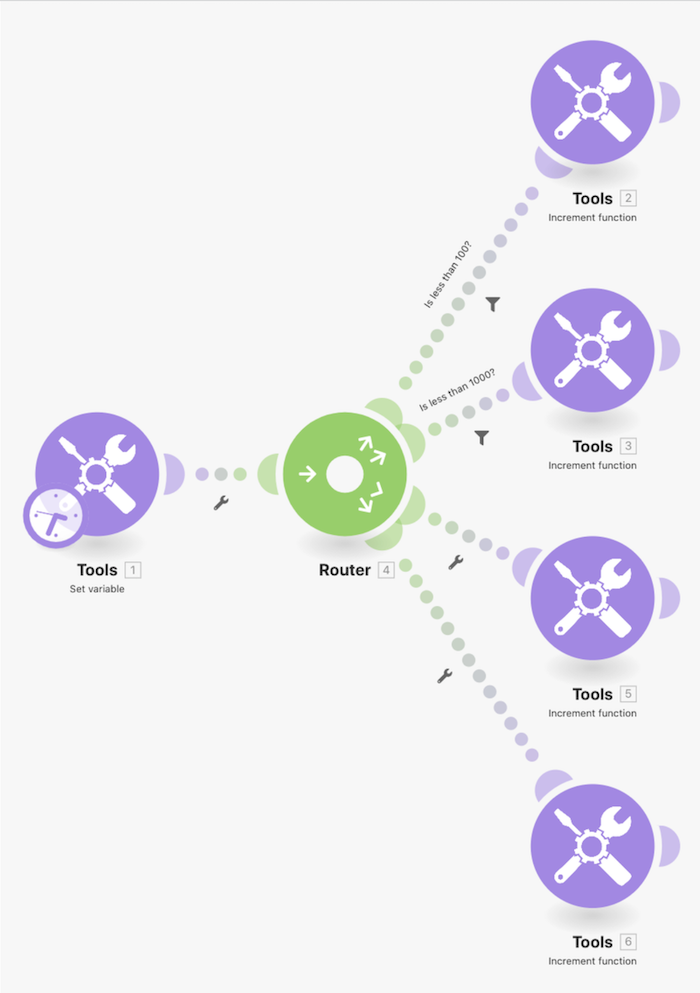

# Procedura dettagliata sui modelli di indirizzamento

Utilizza il modulo Imposta variabile per inviare un numero attraverso più percorsi e vedere come si comportano i filtri e i fallback durante l’indirizzamento.

## Procedura dettagliata sui modelli di indirizzamento

Workfront consiglia di guardare il video della procedura dettagliata relativa all’esercizio, prima di provare a ricrearlo nel proprio ambiente.

>[!VIDEO](https://video.tv.adobe.com/v/335274/?quality=12&learn=on)

## Desideri ulteriori informazioni? Consigliamo quanto segue:

[Documentazione di Workfront Fusion](https://experienceleague.adobe.com/docs/workfront/using/adobe-workfront-fusion/workfront-fusion-2.html?lang=it)
