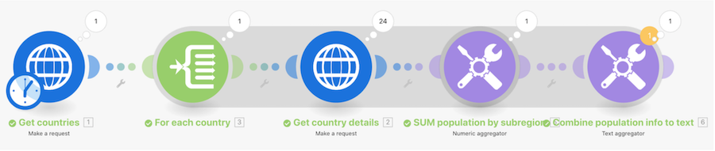

# Procedura dettagliata per l’aggregazione avanzata

Chiama un servizio web per restituire dettagli su più paesi e identificare la popolazione totale di tutti i paesi, raggruppati per sottoregione.

## Procedura dettagliata per l’aggregazione avanzata

Workfront consiglia di guardare il video della procedura dettagliata relativa all’esercizio, prima di provare a ricrearlo nel proprio ambiente.

>[!VIDEO](https://video.tv.adobe.com/v/335281/?quality=12&learn=on&enablevpops=1)

## URL di esercizio

* `https://restcountries.com/v2/lang/es`
* `https://restcountries.com/v2/name/{country name}`

## Rafforzamento del principio di aggregazione

Ogni volta che un modulo produce più bundle, ogni modulo successivo eseguirà ogni bundle.

Per evitare questo problema, aggiungi un aggregatore dopo un modulo che potrebbe produrre più bundle.

Un’ombra evidenzia eventuali segmenti nello scenario da un **beginning-initiator** a un **end-aggregator**. In questo modo è più facile individuare tali segmenti nello scenario di Workfront Fusion.

## Tocca a te

>[!NOTE]
>
>Gli esercizi pratici e le sfide sono facoltativi e non necessari per completare la formazione su Fusion.

Questa esercitazione si basa su quanto appreso nella procedura dettagliata, ma è priva di soluzione.

Crea un nuovo scenario per sommare tutte le ore registrate per le attività nei progetti nel portfolio marketing. Inviare quindi un&#39;e-mail con la seguente dicitura: &quot;Il team di progetto {Project Name} ha registrato {summed hours} delle {planned hours} ore pianificate totali, arrivando a {percentage} del piano.&quot;

**Sfida:** prova a ripetere questo esercizio, ma solo per le ore registrate quest’anno.

## Desideri ulteriori informazioni? Consigliamo quanto segue:

[Documentazione di Workfront Fusion](https://experienceleague.adobe.com/it/docs/workfront-fusion/using/get-started-with-fusion/understand-workfront-fusion/workfront-fusion-overview)
