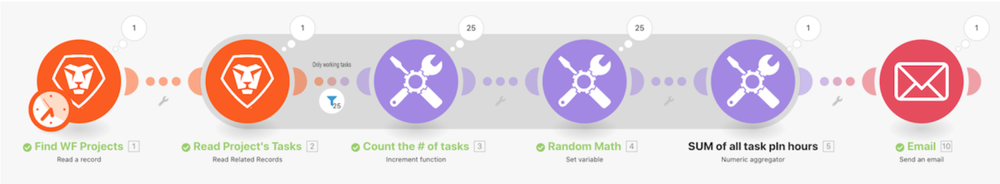

# Procedura dettagliata per l’aggregazione

## Panoramica

Utilizzando lo scenario “Introduzione all’iterazione” creato nell’ultima procedura dettagliata, aggrega le ore pianificate per ogni attività lavorativa nel progetto e invia un’e-mail a te stesso con tali informazioni.

## Procedura dettagliata per l’aggregazione

Workfront consiglia di guardare il video della procedura dettagliata relativa all’esercizio, prima di provare a ricrearlo nel proprio ambiente.

>[!VIDEO](https://video.tv.adobe.com/v/335280/?quality=12&learn=on&enablevpops=1)

## Desideri ulteriori informazioni? Consigliamo quanto segue:

[Documentazione di Workfront Fusion](https://experienceleague.adobe.com/it/docs/workfront-fusion/using/get-started-with-fusion/understand-workfront-fusion/workfront-fusion-overview)
