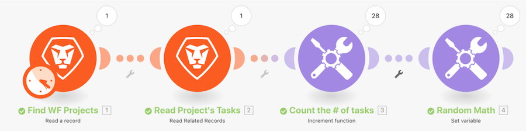

# Procedura dettagliata sull’introduzione agli iteratori

Esamina un progetto specifico in Workfront, quindi esamina tutte le attività all’interno di tale progetto. Quindi utilizzerai il modulo dello strumento Incrementa per contare il numero di attività all’interno del progetto. Infine, utilizzerai il modulo Imposta variabile per sottrarre il numero di elementi secondari dal Numero di problemi aperti per produrre un valore numerico per ciascuno dei bundle delle attività.

## Procedura dettagliata sull’introduzione agli iteratori

Workfront consiglia di guardare il video della procedura dettagliata relativa all’esercizio, prima di provare a ricrearlo nel proprio ambiente.

>[!VIDEO](https://video.tv.adobe.com/v/335278/?quality=12&learn=on&enablevpops=1)

## Desideri ulteriori informazioni? Consigliamo quanto segue:

[Documentazione di Workfront Fusion](https://experienceleague.adobe.com/it/docs/workfront-fusion/using/get-started-with-fusion/understand-workfront-fusion/workfront-fusion-overview)
