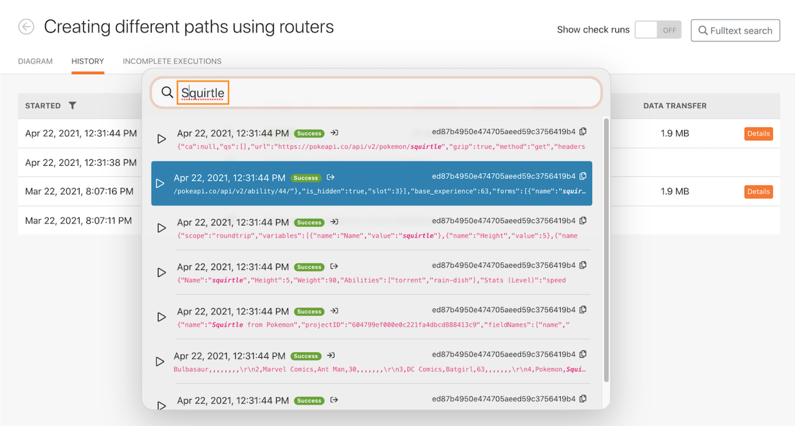

# Procedura dettagliata sulla cronologia di esecuzione

## Panoramica

Rivedi la cronologia di esecuzione per lo scenario &quot;Utilizzo del filtro potente&quot; per comprendere cosa è successo quando si sono verificate le esecuzioni e come sono state strutturate quando sono state eseguite.

## Procedura dettagliata sulla cronologia di esecuzione

Workfront consiglia di guardare il video dettagliato sull&#39;esercizio prima di cercare di ricreare l&#39;esercizio nel proprio ambiente.

>[!VIDEO](https://video.tv.adobe.com/v/335283/?quality=12&learn=on)

>[!TIP]
>
>Per istruzioni dettagliate su come completare la procedura dettagliata, consulta [Procedura dettagliata sulla cronologia di esecuzione](https://experienceleague.adobe.com/docs/workfront-learn/tutorials-workfront/fusion/exercises/execution-history.html?lang=en) esercizio fisico.

## Ricerca full-text nella scheda della cronologia

La ricerca full-text è disponibile nella scheda della cronologia di uno scenario, che ti consente di cercare eventuali dati elaborati nello scenario.

Invece di aprire ogni esecuzione per cercare i dati, la ricerca full-text cerca in tutte le esecuzioni all’interno di un singolo scenario. I risultati della ricerca forniscono un elenco di esecuzioni in cui sono stati trovati i dati ed è possibile fare clic su qualsiasi esecuzione per approfondire la ricerca.

I risultati della ricerca contengono alcune icone utili nell&#39;immagine seguente.

A - Lo stato dell&#39;esecuzione.

B - Se i dati si trovavano nell&#39;input o nell&#39;output del modulo in cui sono stati trovati.

C - L&#39;ID di esecuzione.

D - Copia l&#39;ID di esecuzione.

Quando si fa clic su un&#39;esecuzione, Workfront Fusion carica l&#39;esecuzione e il modulo in cui è stato trovato il risultato della ricerca. E apre l&#39;ispettore di esecuzione sul modulo che contiene i dati di ricerca.

## Vuoi saperne di più? Si consiglia quanto segue:

[Documentazione di Workfront Fusion](https://experienceleague.adobe.com/docs/workfront/using/adobe-workfront-fusion/workfront-fusion-2.html?lang=en)
