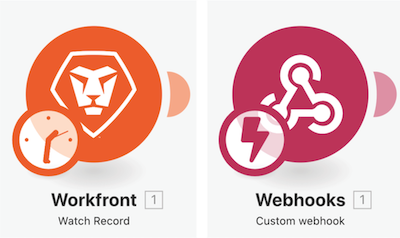
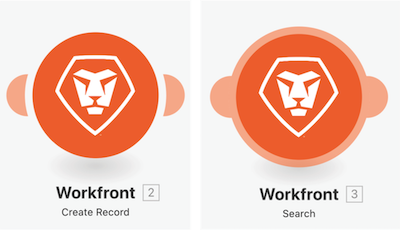

# Acquisisci familiarità con app aggiuntive e moduli comuni

## Promemoria sui tipi di modulo

### Moduli trigger

Possono essere utilizzati solo come primo modulo e possono restituire zero, uno o più bundle che verranno elaborati individualmente nei moduli successivi, a meno che non siano aggregati.

* **Trigger istantaneo** (simbolo di un fulmine sul trigger): attivato immediatamente in base al webhook.
* **Trigger pianificato** (simbolo di orologio sul trigger): funzionalità speciali per tenere traccia dell’ultimo record elaborato.

### Moduli di azioni e ricerca

* **Azione**: utilizzata per eseguire operazioni CRUD (Create, Read, Update, Delete, ossia: Crea, Leggi, Aggiorna, Elimina).
* **Ricerche**: utilizzate per cercare zero, uno o più record che vengono restituiti come bundle che verranno elaborati individualmente nei moduli successivi, a meno che non siano aggregati.

### Acquisisci familiarità con app aggiuntive e moduli comuni

In questo video scoprirai:

* Cosa sono i trigger, le azioni e le ricerche e come differiscono
* Tipi di moduli presenti in diversi connettori di app e loro funzionamento

>[!VIDEO](https://video.tv.adobe.com/v/3417438/?captions=ita&quality=12&learn=on&enablevpops=1)
