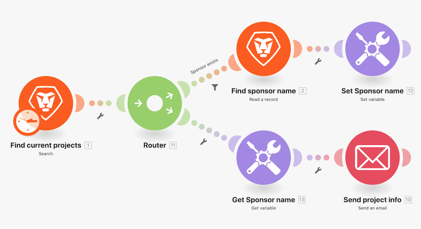

# Procedura dettagliata per la funzione Switch

Per semplici modifiche ai dati, utilizza la funzione Switch per trasformare un valore in un altro all’interno di un campo modulo. In questo esercizio, modifica la chiave di due lettere nel nome effettivo per lo Stato avanzamento del progetto inviato in un messaggio e-mail.

## Procedura dettagliata per la funzione Switch

Workfront consiglia di guardare il video della procedura dettagliata relativa all’esercizio, prima di provare a ricrearlo nel proprio ambiente.

>[!VIDEO](https://video.tv.adobe.com/v/3417450/?captions=ita&quality=12&learn=on&enablevpops=1)

## Desideri ulteriori informazioni? Consigliamo quanto segue:

[Documentazione di Workfront Fusion](https://experienceleague.adobe.com/it/docs/workfront-fusion/using/get-started-with-fusion/understand-workfront-fusion/workfront-fusion-overview)
