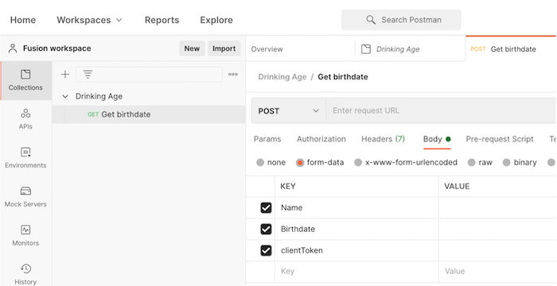

# Procedura dettagliata sui webhook

Questo scenario crea un’app per un negozio di generi alimentari in modo da poter determinare facilmente se un cliente è maggiorenne per l’acquisto di alcolici. La persona addetta alla cassa deve pubblicare semplicemente il nome e la data di nascita dell’acquirente E un token client verificato nell’URL fornito. Dopo l’inserimento, questo attiverà lo scenario per il calcolo della risposta appropriata e la restituirà al richiedente.

## Procedura dettagliata sui webhook

Workfront consiglia di guardare il video della procedura dettagliata relativa all’esercizio, prima di provare a ricrearlo nel proprio ambiente.

>[!VIDEO](https://video.tv.adobe.com/v/335292/?quality=12&learn=on&enablevpops=1)

## Configurazione Postman

Per seguire l’esercizio di procedura dettagliata, è necessario scaricare l’applicazione gratuita Postman. Per accedere all’esercizio nell’area destra di Postman, seguire i passaggi sottostanti.

1. Crea un’area di lavoro, quindi aprila.
1. Fai clic sulla scheda Nuovo e crea una nuova raccolta denominata Età alcolici.
1. Fai clic di nuovo sulla scheda Nuovo e crea una nuova richiesta GET denominata GET data di nascita.
1. Modifica l’azione di richiesta da GET a POST.
1. Passa all’area della scheda secondaria Corpo sotto il campo URL POST.
1. Scegli i dati del modulo sotto la scheda secondaria Autorizzazione.
1. Crea tre chiavi per Nome, Data di nascita e clientToken.

## Tocca a te

>[!NOTE]
>
>Gli esercizi pratici e le sfide sono facoltativi e non necessari per completare la formazione su Fusion.

Questa esercitazione si basa su quanto appreso nella procedura dettagliata, ma è priva di soluzione.

Crea un webhook di Workfront in attesa di nuovi aggiornamenti creati e quindi registra la data, il nome della persona che ha effettuato l’aggiornamento e ciò che dice l’aggiornamento. Invia a te stesso queste informazioni tramite e-mail.

**Suggerimento**: utilizza il modulo trigger Watch Events (Osserva eventi) di Workfront per creare il tuo webhook. Inoltre, in Workfront gli aggiornamenti sono denominati note.

**Sfida**: riesci a trovare e aggiungere l’URL dell’aggiornamento effettuato per il facile accesso?

## Desideri ulteriori informazioni? Consigliamo quanto segue:

[Documentazione di Workfront Fusion](https://experienceleague.adobe.com/it/docs/workfront-fusion/using/get-started-with-fusion/understand-workfront-fusion/workfront-fusion-overview)
