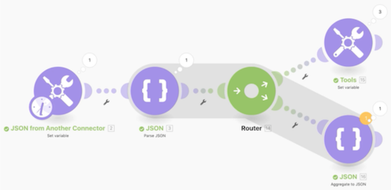

# Procedura dettagliata per lavorare con JSON

Scopri come creare e analizzare file JSON all’interno di uno scenario per supportare le tue esigenze di progettazione.

## Procedura dettagliata sugli array

Workfront consiglia di guardare il video della procedura dettagliata relativa all’esercizio, prima di provare a ricrearlo nel proprio ambiente.

In questo video scoprirai come:

* Creare e analizzare JSON all’interno di uno scenario per supportare le tue esigenze di progettazione

>[!VIDEO](https://video.tv.adobe.com/v/3418113/?captions=ita&quality=12&learn=on&enablevpops=1)

## Desideri ulteriori informazioni? Consigliamo quanto segue:

[Documentazione di Workfront Fusion](https://experienceleague.adobe.com/it/docs/workfront-fusion/using/get-started-with-fusion/understand-workfront-fusion/workfront-fusion-overview)
