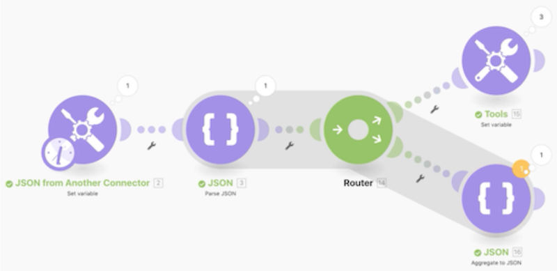

# Procedura dettagliata sull’utilizzo di JSON

## Panoramica

Scopri come creare e analizzare JSON in uno scenario per soddisfare le tue esigenze di progettazione.

## Procedura dettagliata sugli array

Workfront consiglia di guardare il video dettagliato sull&#39;esercizio prima di cercare di ricreare l&#39;esercizio nel proprio ambiente.

Questo video illustra come:

* Creare e analizzare JSON in uno scenario per soddisfare le tue esigenze di progettazione

>[!VIDEO](https://video.tv.adobe.com/v/335301/?quality=12)

>[!TIP]
>
>Per istruzioni dettagliate su come completare la procedura dettagliata, consulta [Procedura dettagliata sull’utilizzo di JSON](https://experienceleague.adobe.com/docs/workfront-learn/tutorials-workfront/fusion/exercises/working-with-json.html?lang=en) esercizio fisico.

## Vuoi saperne di più? Si consiglia quanto segue:

[Documentazione di Workfront Fusion](https://experienceleague.adobe.com/docs/workfront/using/adobe-workfront-fusion/workfront-fusion-2.html?lang=en)
