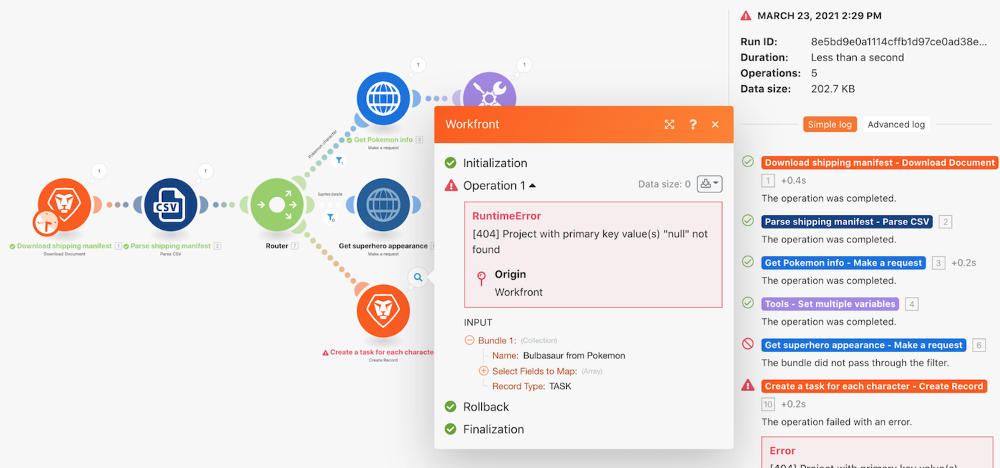

# Procedura dettagliata sulla gestione degli errori

Scopri in cosa consiste la gestione degli errori predefinita e come aggiungere la gestione degli errori di moduli specifici utilizzando le direttive.

## Procedura dettagliata sulla gestione degli errori

Workfront consiglia di guardare il video della procedura dettagliata relativa all’esercizio, prima di provare a ricrearlo nel proprio ambiente.

>[!VIDEO](https://video.tv.adobe.com/v/335306/?quality=12&learn=on&enablevpops=1)

## Desideri ulteriori informazioni? Consigliamo quanto segue:

[Documentazione di Workfront Fusion](https://experienceleague.adobe.com/it/docs/workfront-fusion/using/get-started-with-fusion/understand-workfront-fusion/workfront-fusion-overview)
