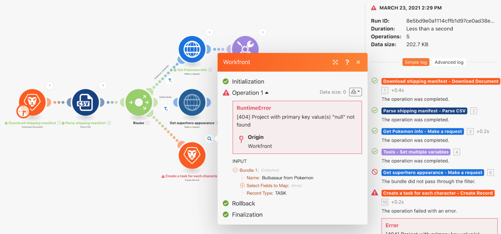

# Procedura dettagliata sulla gestione degli errori

## Panoramica

Comprendere come si verifica la gestione degli errori predefiniti e come aggiungere una gestione degli errori del modulo specifica utilizzando le direttive.

## Procedura dettagliata sulla gestione degli errori

Workfront consiglia di guardare il video dettagliato sull&#39;esercizio prima di cercare di ricreare l&#39;esercizio nel proprio ambiente.

>[!VIDEO](https://video.tv.adobe.com/v/335306/?quality=12)

## Vuoi saperne di più? Si consiglia quanto segue:

[Documentazione di Workfront Fusion](https://experienceleague.adobe.com/docs/workfront/using/adobe-workfront-fusion/workfront-fusion-2.html?lang=en)
