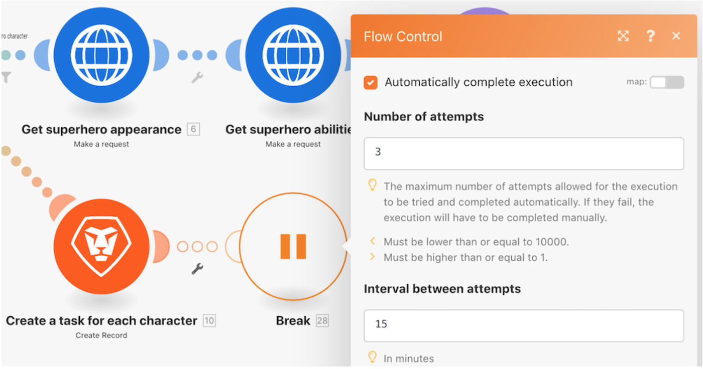

# Comprendere le direttive per la gestione degli errori

In questo video scoprirai:

* Le tre direttive dell’handler degli errori che consentono la continuazione dell’esecuzione
* Le due direttive dell’handler degli errori che interrompono l’esecuzione

>[!VIDEO](https://video.tv.adobe.com/v/335305/?quality=12&learn=on&enablevpops=1)

## Direttive — Continuazione dello scenario

### Resume (Riprendi)

* Un output sostitutivo viene specificato e fornito al modulo che rileva un errore.
* I moduli successivi vengono elaborati.
* Lo stato di esecuzione dello scenario viene contrassegnato come “Success” (Completato).

### Break (Interrompi)

* Lo stato di esecuzione dello scenario viene memorizzato nella coda delle esecuzioni incomplete dove l’errore può essere risolto manualmente. Vi sono tuttavia alcune eccezioni qui menzionate.
* I moduli successivi non vengono elaborati.
* Se sono presenti bundle non elaborati, l’esecuzione dello scenario continua normalmente.
* Lo stato di esecuzione dello scenario è contrassegnato come “Warning” (Avvertenza).

### Ignora

* L’errore viene ignorato e i moduli successivi non vengono elaborati.
* Se sono presenti bundle non elaborati, l’esecuzione dello scenario continua normalmente.
* Lo stato di esecuzione dello scenario viene contrassegnato come “Success” (Completato).

## Direttive — Interruzione dello scenario

### Rollback

* L’esecuzione dello scenario viene interrotta immediatamente e viene avviata una fase di rollback su tutti i moduli nel tentativo di ripristinarne lo stato iniziale.
* I moduli successivi non vengono elaborati.
* Salvo alcuni tipi di errore, lo scenario viene disattivato dopo il “numero di errori consecutivi” specificato nelle impostazioni dello scenario.
* Lo stato di esecuzione dello scenario è contrassegnato come “Error” (Errore).

>[!NOTE]
>
>Questo è il comportamento predefinito se al modulo non è collegato alcun percorso dell’handler degli errori e l’impostazione “Allow Storing Incomplete Executions” (Consenti memorizzazione di esecuzioni incomplete) nelle impostazioni dello scenario non è selezionata.

### Conferma

* L’errore viene ignorato e i moduli successivi non vengono elaborati.
* Se sono presenti bundle non elaborati, l’esecuzione dello scenario continua normalmente.
* Lo stato di esecuzione dello scenario viene contrassegnato come “Success” (Completato).

