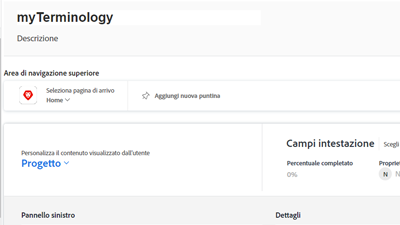
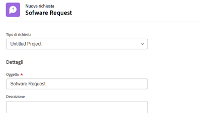

# Tutorials Workfront {#overview}

Una libreria di video e articoli di formazione progettati per aiutarti a comprendere meglio le funzioni e le impostazioni di Workfront.  Inclusa è una raccolta di best practice, esercizi curati e altre risorse che aiuteranno te e la tua organizzazione ad avere successo con Workfront.

>[!VIDEO](https://video.tv.adobe.com/v/335063/?quality=12)

<!-- 

This is the landing page of the user guide. It should be the first list item in the TOC.md file. 
See other user landing pages to get ideas. 

-->

## Quali sono le novità?

Scopri gli ultimi aggiornamenti apportati ai tutorial per ogni versione di Workfront. Ecco cosa è stato aggiornato con l’ultima versione:

* L&#39;icona dei preferiti e quella dei recenti erano separate nella navigazione superiore in Workfront. Un breve riepilogo di ciascuna è disponibile nella sezione <a href="/help/manage-work/projects/find-projects.md">Trova Progetti</a> esercitazione.

* Configurare un modulo personalizzato per l&#39;utilizzo con più tipi di oggetto. Scopri come nella <a href="/help/custom-data/custom-forms/custom-forms-creating-and-sharing-a-custom-form.md">creare e condividere un modulo personalizzato</a> esercitazione.

## Scelte del personale

<table style="margin-top: 0 !important">
  <tr>
   <td>
      
      

         <a href="/help/administration-and-setup/layout-templates/find-layout-templates.md"><strong>Trovare e creare modelli di layout</strong></a>
      

      

         <em>Scopri come creare un modello di layout di base.</em>
      

    </td>
   <td>
      
      

         <a href="/help/manage-work/issues-requests/make-a-request.md"><strong>Fai una richiesta</strong></a>
      

      

         <em>Scopri come effettuare, visualizzare e modificare le richieste.</em>
      

<td>
      
      

         <a href="/help/reporting/basic-reporting/create-a-simple-report.md"><strong>Creare un rapporto semplice</strong></a>
      

      

         <em>Scopri come creare un semplice rapporto personalizzato.</em>
      

    </td>
  </tr>
</table>

