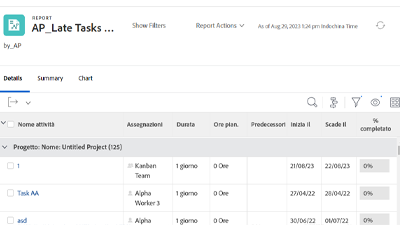

# Tutorial su Workfront {#overview}

Una libreria di video e articoli di formazione progettati per aiutarti a comprendere meglio le funzionalità e le impostazioni di Workfront.  È inclusa una raccolta di best practice, con esercizi selezionati e altre risorse che aiuteranno te e la tua organizzazione ad avere successo con Workfront.

>[!VIDEO](https://video.tv.adobe.com/v/335063/?quality=12&learn=on)

<!-- 

This is the landing page of the user guide. It should be the first list item in the TOC.md file. 
See other user landing pages to get ideas. 

-->

## Scelte del personale

<table style="margin-top: 0 !important">
  <tr>
   <td>
      
      

         <a href="/help/administration-and-setup/layout-templates/find-layout-templates.md"><strong>Trovare e creare modelli di layout</strong></a>
      

      

         <em>Scopri come creare un modello di layout di base.</em>
      

    </td>
   <td>
      
      

         <a href="/help/manage-work/issues-requests/make-a-request.md"><strong>Effettuare una richiesta</strong></a>
      

      

         <em>Scopri come effettuare, visualizzare e modificare le richieste.</em>
      

<td>
      
      

         <a href="/help/reporting/basic-reporting/create-a-simple-report.md"><strong>Creare un rapporto semplice</strong></a>
      

      

         <em>Scopri come creare un rapporto personalizzato semplice.</em>
      

    </td>
  </tr>
</table>

