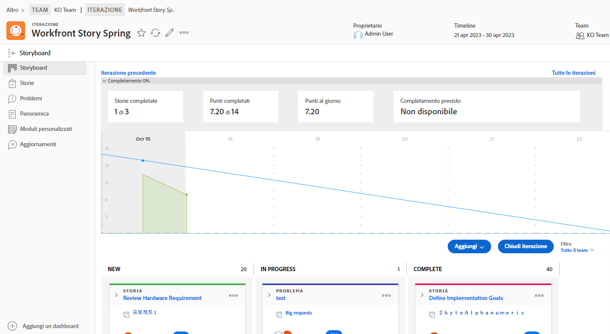
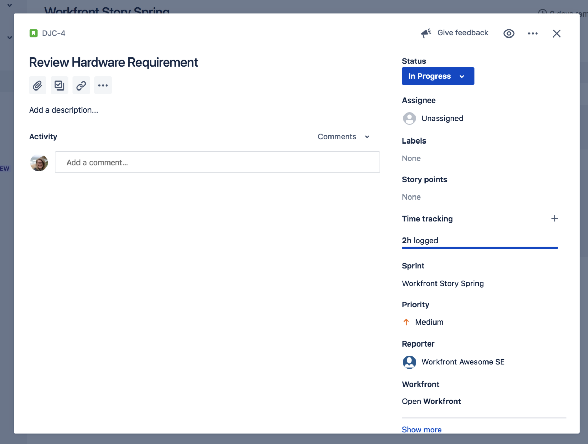
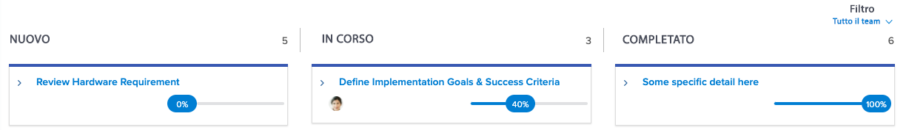

# Creare visibilità con l’ Integrazione [!DNL Jira]

[!DNL Jira] è un prodotto utilizzato per tenere traccia di progetti e problemi per i team di sviluppo e supporto tecnico. Sebbene molti team utilizzino Jira per tenere traccia dei progressi a livello di attività, utilizzano [!DNL Workfront] per gestire realmente il progetto così da ottenere una visione dello stato di avanzamento di alto livello. Con l’integrazione nativa di [!DNL Jira], queste informazioni possono essere trasferite automaticamente tra le due applicazioni.

## Che cos’è [!DNL Jira] ?

[!DNL Jira] è un prodotto creato da [!DNL Atlassian] per tenere traccia di progetti e problemi per i team di sviluppo e supporto tecnico. Molti team usano [!DNL Jira] per tenere traccia dei progressi a livello di attività, ma usano anche [!DNL Workfront] per gestire progetti. Ciò significa che i team raddoppiano i propri sforzi creando attività entrambe in [!DNL Workfront] e [!DNL Jira]. Tuttavia, con l’integrazione nativa di [!DNL Jira], le informazioni di questo tipo possono essere trasferite automaticamente tra le due applicazioni.

## Come posso installare Adobe Workfront per Jira?

Passa a [Adobe Workfront per Jira](https://experienceleague.adobe.com/docs/workfront/using/adobe-workfront-integrations/workfront-for-jira/workfront-for-jira.html?lang=it) per scoprire come installare e configurare Adobe Workfront per Jira.

## Che cosa può fare l’integrazione di [!DNL Jira]?

Qui abbiamo uno sprint in [!DNL Workfront] intitolato “[!DNL Workfront] Story Spring.”

Joan Harris, responsabile del team Agile del Dev-Jedi Council, utilizza la bacheca Scrum e il grafico di lavoro per misurare i progressi dello sprint complessivo. Fornisce al team una bella rappresentazione visiva di ciò che sta succedendo. Inoltre, queste informazioni confluiscono in un rapporto esecutivo che viene rivisto ogni trimestre. Tuttavia, la maggior parte del team effettua gli aggiornamenti in [!DNL Jira], non in [!DNL Workfront].

Il team di Joan ha utilizzato [!DNL Jira] per diversi anni e trova che sia un buon modo per tenere traccia delle singole attività e/o dei bug a cui è assegnato per lavorare. Ma Joan ha davvero bisogno di quelle informazioni per connettersi a [!DNL Workfront] e, in ultima analisi, far avanzare quei rapporti esecutivi.

Attraverso l’integrazione nativa di [!DNL Jira], qualsiasi aggiornamento apportato ad attività, storie o bug può aggiornare automaticamente le attività, storie e/o problemi in [!DNL Workfront].

In questo modo, quando il membro del team assegnato alla storia Verifica requisiti hardware effettua un aggiornamento dello stato in [!DNL Jira], spostandolo da “Nuovo” a “In corso”, tale aggiornamento cambierà automaticamente lo stato della storia anche in [!DNL Workfront].

