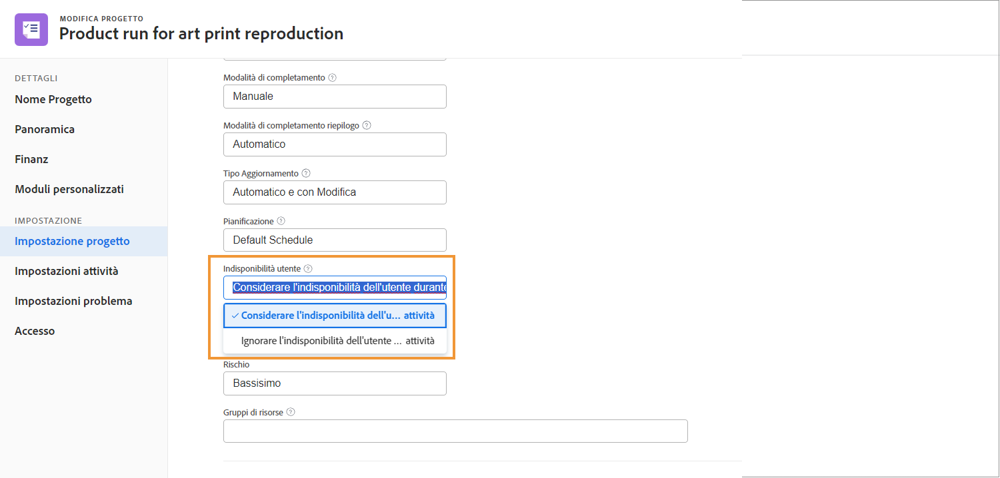
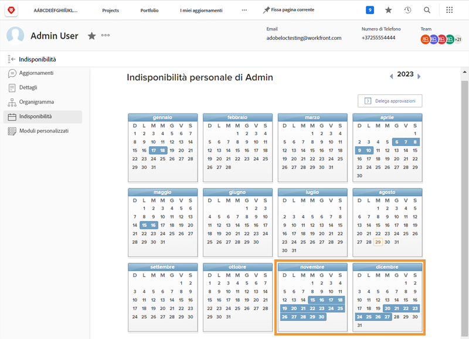
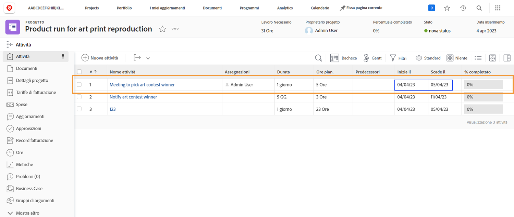
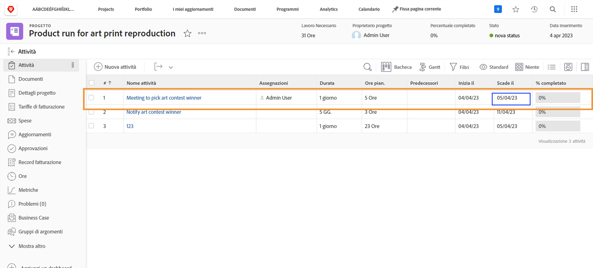
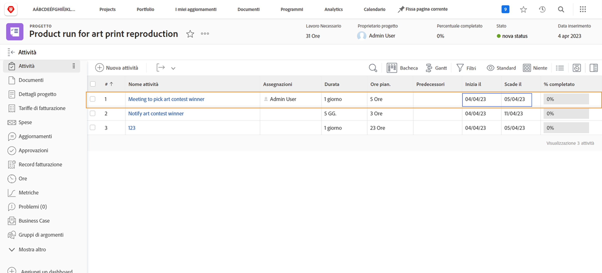

# In che modo le assenze influiscono sulle timeline del progetto

Il fatto che l’assenza di un utente assegnato venga presa in considerazione nella timeline del progetto dipende da un’impostazione del progetto denominata [!UICONTROL Assenza utente]. Questa impostazione determina se le assenze dell’assegnatario principale dell’attività modificano le date pianificate per l’attività nel progetto.

Osserviamo cosa accade con una timeline del progetto quando ciascuna delle impostazioni è selezionata: [!UICONTROL Considera assenza utente nelle durate attività] o [!UICONTROL Ignora assenza utente nelle durate attività].

## Considerare l&#39;indisponibilità dell&#39;utente durante l&#39;attività

Questa opzione è l’impostazione predefinita di Workfront.

In questo esempio, il calendario personale dell’assegnatario principale dell’attività contiene giorni liberi.

Il project manager desidera assegnare questa persona a un’attività con date pianificate che si sovrappongono alle assenze dell’utente.

Quando questo utente viene assegnato all’attività, le date pianificate vengono modificate automaticamente. Ora la data di completamento pianificata dell’attività è stata estesa di diversi giorni per accogliere le assenze dell’utente. È importante notare che questa modifica può influenzare le date pianificate di altre attività nel progetto e, potenzialmente, la data di completamento pianificata del progetto.

## [!UICONTROL Ignorare l&#39;indisponibilità dell&#39;utente durante l&#39;attività]

Con questa opzione, le date pianificate dell’attività rimangono quelle pianificate in origine, anche se l’assegnatario principale presenta un’indisponibilità durante la durata dell’attività.

Il membro del team ha giorni liberi contrassegnati sul calendario.

Il project manager assegna loro un compito che si sovrappone ai periodi di assenza. Una volta assegnato l’utente, le date pianificate dell’attività rimangono quelle pianificate in origine.

Per garantire che il lavoro venga eseguito in tempo, potrebbe essere utile assegnare un’altra persona all’attività, in modo che possa lavorare mentre l’assegnatario originale è assente.

## Regolare l’impostazione a livello di progetto

Per modificare l’impostazione Assenza utente in un progetto:

* Apri il progetto facendo clic sul nome in Workfront.

* Seleziona [!UICONTROL Modifica] dal menu a 3 punti nell’intestazione della pagina, a destra del nome del progetto.

* Scorri fino alla sezione [!UICONTROL Impostazioni progetto] e trova il campo [!UICONTROL Assenza utente].

* Seleziona l’opzione che desideri applicare al progetto: [!UICONTROL Considera asssenza utente nelle durate attività] o [!UICONTROL Ignora assenza utente nelle durate attività].

* Fai clic sul pulsante [!UICONTROL Salva] nell’angolo superiore destro della finestra.

**Nota**: questa impostazione non è disponibile quando si seleziona [!UICONTROL Dettagli progetto] dal menu del pannello a sinistra della pagina del progetto.

Per questo, esiste un’impostazione globale nelle preferenze del progetto del menu [!UICONTROL Configurazione]. Questa impostazione è gestita dall’amministratore di sistema. Gli amministratori di gruppi possono modificare questa impostazione per i gruppi che gestiscono.

Workfront consiglia di effettuare l’impostazione nel modo in cui desideri che la maggior parte dei progetti gestisca le assenze dell’utente nella tua organizzazione.

L’impostazione può anche essere incorporata nei modelli di progetto, attraverso i dettagli del modello.
