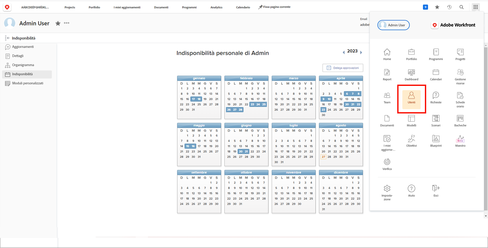

# Gestire le ferie di un altro utente

I manager o gli altri leader possono gestire i calendari delle ferie dei membri del team se dispongono delle autorizzazioni Modifica utente assegnate tramite il livello di accesso di Workfront. I livelli di accesso vengono creati e assegnati dagli amministratori di sistema di Workfront.

Workfront consiglia di definire un criterio o una procedura da seguire quando un manager aggiorna il calendario personale delle ferie di un dipendente.

Per gestire il calendario di un altro utente:

* Fai clic su [!UICONTROL Menu principale] e seleziona Utenti.

* Utilizza l’icona di ricerca per trovare l’utente o scorri l’elenco.

* Fai clic sul nome dell’utente nell’elenco.

* Fai clic su [!UICONTROL Ferie] nel menu del pannello a sinistra nella pagina del profilo dell’utente.

* Fai clic su una data nel calendario.

* Workfront presuppone un’intera giornata di ferie. In questo caso, fai clic sul pulsante [!UICONTROL Salva].

* Per più giorni di ferie consecutivi, modifica la data A con l’ultimo giorno di assenza dall’ufficio. Fai clic sul pulsante [!UICONTROL Salva].

* Se contrassegni un giorno di ferie parziale, deseleziona la casella [!UICONTROL Tutto il giorno]. Quindi indica le ore in cui l&#39;utente lavorerà quel giorno (le ore in cui è disponibile). Fai clic sul pulsante [!UICONTROL Salva].
