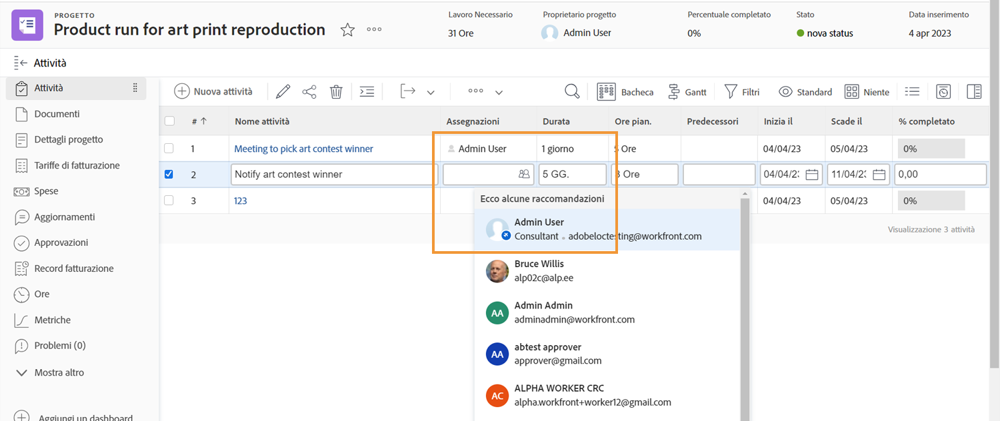
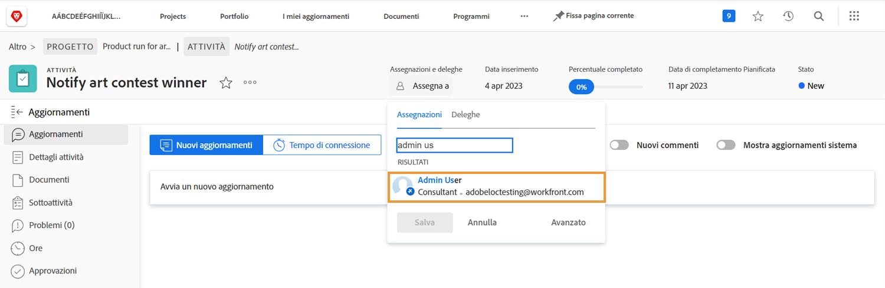

# Visualizzare le ferie durante l’assegnazione delle attività

Una piccola icona indica che durante l’assegnazione degli utenti un utente ha segnato le ferie sul calendario personale.

Quando assegni un progetto digitando il nome di un utente, il nome dell’utente diventa grigio e accanto all’immagine dell’avatar compare una piccola icona di avviso blu.

Se si esegue l’assegnazione dall’intestazione della pagina dell’attività, accanto all’avatar della persona viene visualizzata una piccola icona blu a forma di aeroplano per avvisare che l’utente è in ferire durante la durata di tale attività.

