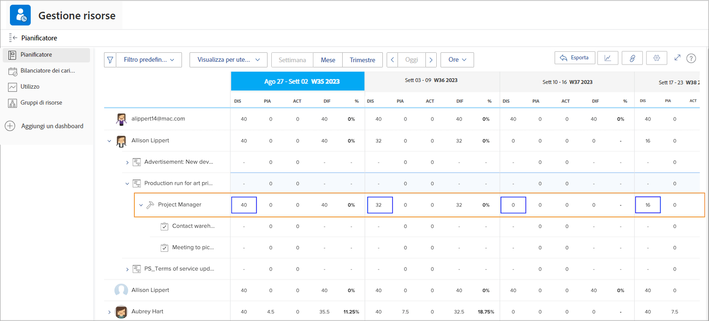
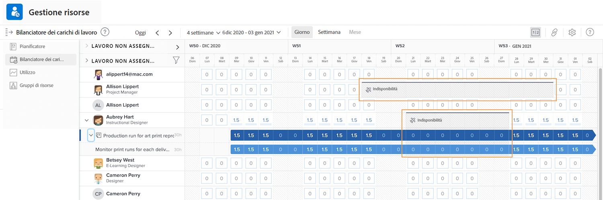

# Visibilità negli strumenti di gestione delle risorse

Conoscere chi è disponibile e quando è fondamentale per la pianificazione e la gestione delle risorse. Quando gli utenti segnano le proprie ferie nel calendario in Workfront, tali informazioni possono essere visualizzate anche negli strumenti di Workfront per le risorse.

## Pianificazione risorse

Le ferie degli utenti vengono riportate nella colonna Disponibile (DIS) nella Pianificazione risorse. Workfront sottrae le ferie segnate sul calendario dal tempo disponibile, calcolato da Workfront in base alla pianificazione assegnata, alla percentuale di mansioni, ecc.

## Bilanciamento del carico di lavoro

Nel Bilanciamento del carico di lavoro, le ferie vengono visualizzate come barre grigie sul calendario. Questa visibilità consente ai manager risorse e ad altri utenti di prendere decisioni più informate durante l’assegnazione del lavoro.

Tuttavia, l’indicatore delle ferie non impedisce l’assegnazione del lavoro all’utente tramite il Bilanciamento del carico di lavoro. Se il lavoro è assegnato, il Bilanciamento del carico di lavoro mostra che la persona è sovra-allocata durante il periodo di ferie.

