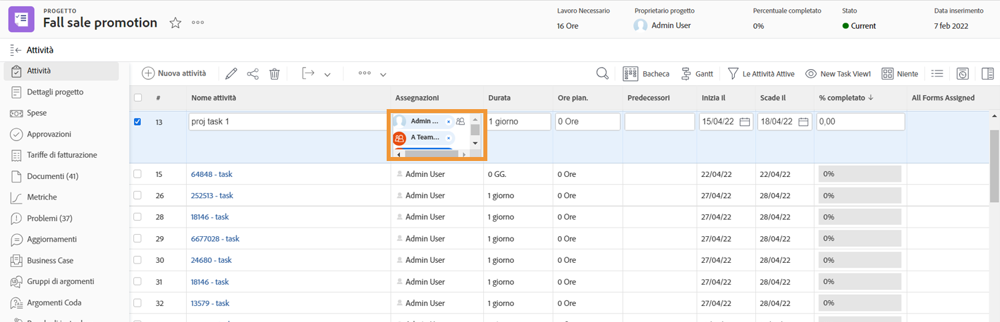
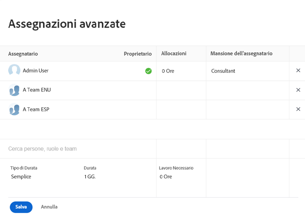
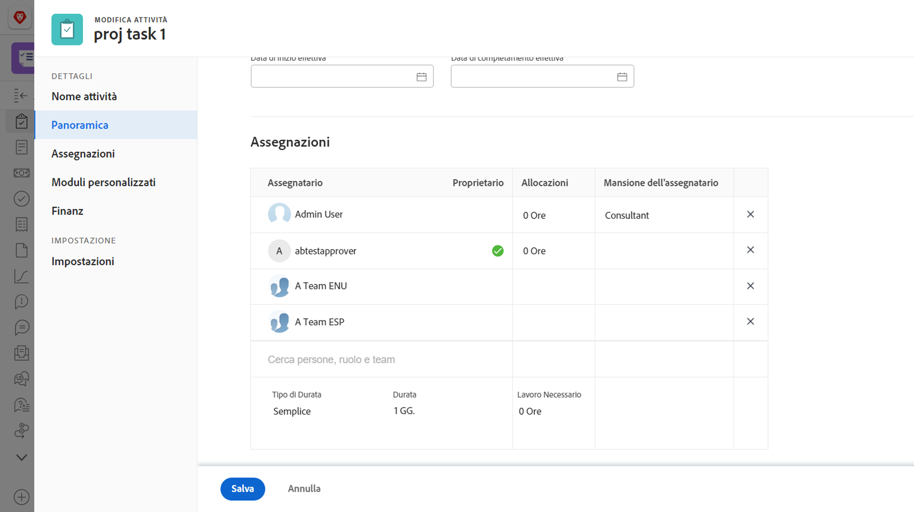

# Che cos’è un assegnatario principale?

Quando due o più utenti vengono assegnati a un’attività, esiste un assegnatario principale. Il calendario delle ferie dell’assegnatario principale è quello che Workfront osserva quando applica l’impostazione Ferie utente.

Dalla pagina del progetto puoi scoprire chi è l’assegnatario principale. Fai clic sul campo Assegnazioni, quindi fai clic sull’icona Assegnazioni avanzate nell’angolo.

Nella finestra Assegnazioni avanzate, l’assegnatario principale o il proprietario dell’attività viene designato con un segno di spunta verde. Passa il puntatore del mouse su un altro utente e fai clic sul collegamento Rendi principale per cambiare il proprietario dell’attività.

Puoi anche modificare l’assegnatario principale dalla pagina dell’attività. Seleziona la casella sull’attività nell’elenco dei progetti, quindi fai clic sull’icona Modifica. Scorri fino alla sezione Assegnazioni e fai clic sul pulsante per designare il proprietario dell’attività.

