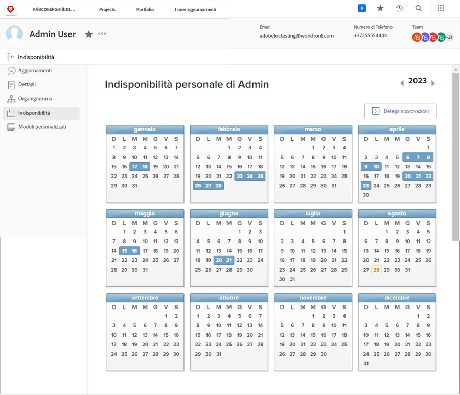
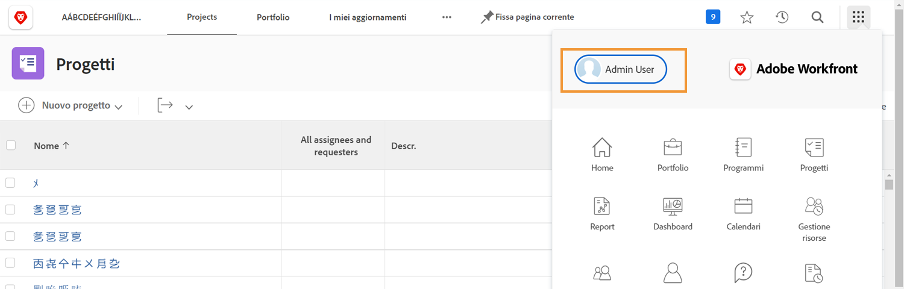
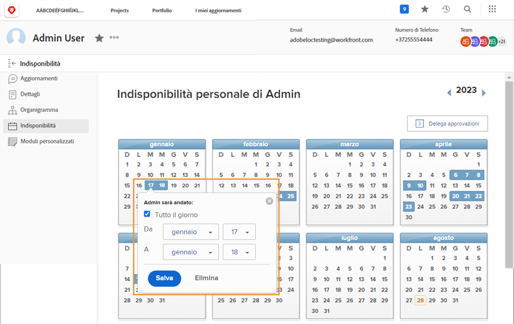

# Perché utilizzare il calendario delle ferie?

Quando i responsabili della pianificazione e i project manager assegnano attività in Workfront, per il completamento puntuale del progetto è importante sapere quali membri del gruppo sono disponibili per completare il lavoro assegnato.

La presenza di dati precisi sulla disponibilità influisce anche sulla pianificazione del lavoro corrente e futura, in quanto i responsabili delle risorse verificano l’allocazione con gli strumenti di Workfront per la pianificazione e la gestione delle risorse.

Gli utenti con una licenza Lavoro e Pianificazione di Workfront possono utilizzare il calendario personale delle ferie per indicare quando non saranno disponibili durante il normale orario di lavoro. Anche una mezza giornata di ferie potrebbe influire sul completamento delle attività a loro assegnate.

**Nota**: Workfront non è progettato per replicare o sostituire i sistemi esistenti della tua organizzazione per la gestione, la maturazione o il tracciamento delle ferie del personale. Per richiedere e gestire le ferie, segui le linee guida della tua organizzazione.

## Contrassegnare le ferie

Il calendario delle ferie personali è presente nella pagina utente di Workfront, accessibile dal menu principale. Fai clic sul tuo nome nell’angolo a sinistra.

* Fai clic su Ferie nel menu del pannello a sinistra nella pagina utente in Workfront.

* Per impostazione predefinita, viene visualizzato l’anno in corso. Se necessario, utilizza le frecce per selezionare un anno diverso (in alto a destra nella finestra del calendario).

* Fai clic su una data nel calendario.

* Workfront presuppone che ti prenda l’intera giornata di ferie. Se è così, fai clic sul pulsante Salva.

* Se desideri prendere delle giornate intere consecutive, cambia la data di fine impostandola sull’ultimo giorno di assenza. Fai clic sul pulsante Salva.

* Se non desideri prendere tutto il giorno libero, deseleziona la casella Tutto il giorno. Quindi indica le ore in cui lavorerai quel giorno (le ore in cui sei disponibile). Fai clic sul pulsante Salva.

Le tue ferie sono indicate dalle caselle blu nel calendario. Le ferie vengono visualizzate anche in altre aree di Workfront per facilitare la pianificazione dei progetti e delle risorse.

**Suggerimento**: se un’attività ti è già stata assegnata, e successivamente inserisci le ferie nel calendario, non verrà inviata alcuna notifica al project manager per comunicare che non sarai disponibile. Ricordati di informare il project manager di eventuali nuove ferie che potrebbero interessare progetti correnti o lavori a te assegnati.
