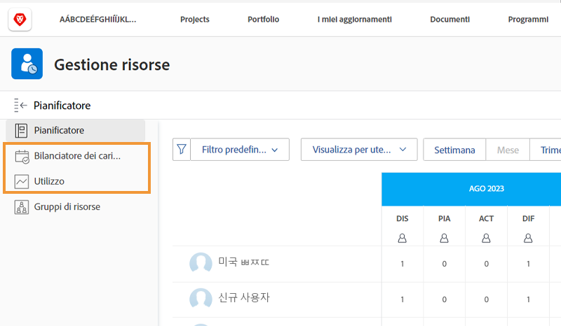

# Impostazioni di gestione delle risorse, Bilanciatore dei carichi di lavoro e rapporto sull&#39;utilizzo

[!DNL Workfront] offre dati, attraverso più strumenti in [!DNL Workfront], per semplificare le decisioni sulle risorse e agevolare i processi. Per visualizzare cosa succede alle tue risorse, assicurati che i tuoi manager, gli utenti e i progetti siano configurati correttamente. Queste configurazioni sono utili anche se non prevedi di utilizzare tutti [!DNL Workfront's] strumenti di gestione delle risorse.

In questa sezione scoprirai:

* Come impostare i manager risorse con l’accesso corretto
* Come visualizzare il bilanciatore del carico di lavoro e il rapporto sull’utilizzo

## Configurazioni di gestione delle risorse

Iniziamo con assicurandoci che le persone giuste abbiano accesso a e possano amministrare le risorse della tua organizzazione.

&lt;!Scarica la guida per istruzioni dettagliate.&gt;

## Bilanciatore del carico di lavoro e rapporto sull’utilizzo

Insieme alla Pianificazione risorse e ai Pool di risorse, gli utenti possono accedere a strumenti aggiuntivi, come il Bilanciatore del carico di lavoro e il rapporto sull’utilizzo, se dispongono dell’autorizzazione Modifica a livello di accesso.

Non è necessaria alcuna altra impostazione per accedere o gestire le risorse tramite questi strumenti.

