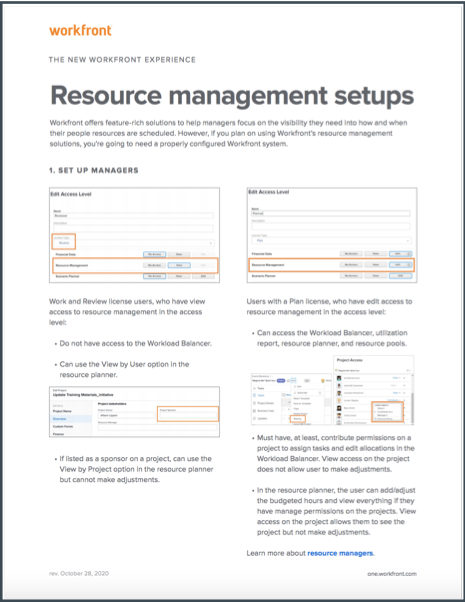
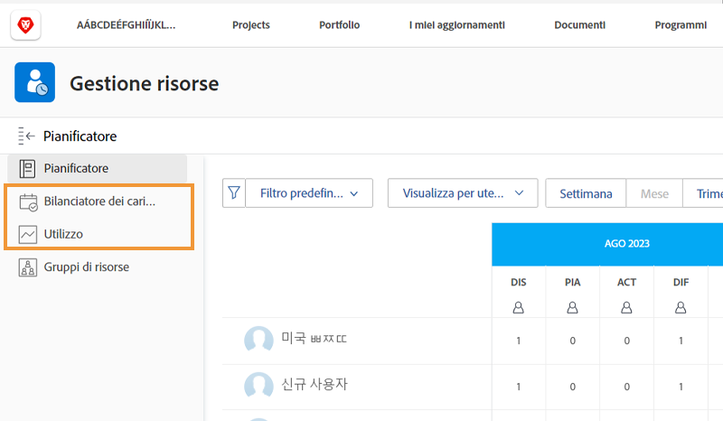

# Configurazioni di Gestione delle risorse, Bilanciatore dei carichi di lavoro e Rapporto sull’utilizzo

[!DNL Workfront] offre dati, attraverso più strumenti in [!DNL Workfront], per semplificare le decisioni sulle risorse e agevolare i processi. Per scoprire cosa stanno facendo le tue risorse, assicurati che i tuoi manager, utenti e progetti siano configurati correttamente. Queste configurazioni sono utili anche se non prevedi di utilizzare tutti gli strumenti di gestione delle risorse di [!DNL Workfront's].

In questa sezione scoprirai:

* Come impostare i manager risorse con l’accesso corretto
* Come visualizzare il bilanciatore del carico di lavoro e il rapporto sull’utilizzo

## Configurazioni di gestione delle risorse

Per iniziare, assicurati che le persone giuste abbiano accesso alle risorse e possano gestirle.

&lt;!Scaricare la guida per istruzioni dettagliate.&gt;

## Bilanciatore del carico di lavoro e rapporto sull’utilizzo

Insieme alla Pianificazione risorse e ai Pool di risorse, gli utenti possono accedere a strumenti aggiuntivi, come il Bilanciatore del carico di lavoro e il rapporto sull’utilizzo, se dispongono dell’autorizzazione Modifica a livello di accesso.

Non è necessaria alcuna altra impostazione per accedere o gestire le risorse tramite questi strumenti.

