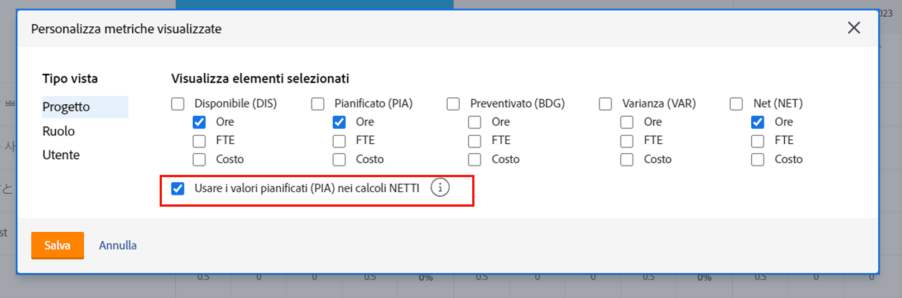
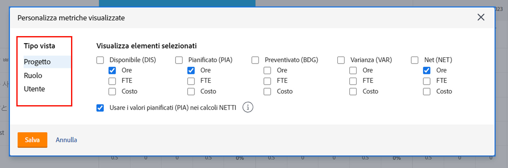
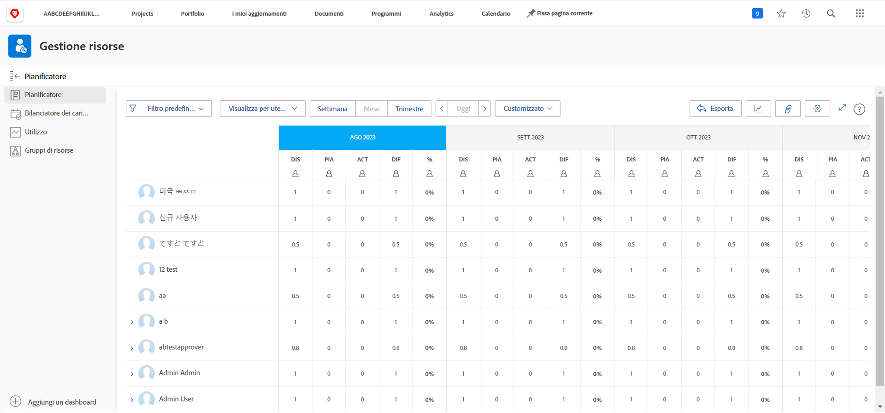

# Visualizza per mansione in [!DNL Resource Planner]

In questo video:

* Consulta la vista [!UICONTROL Visualizza per mansione]
* Scopri come vengono visualizzate le informazioni sulle risorsa in questa vista

>[!VIDEO](https://video.tv.adobe.com/v/335169/?quality=12&learn=on)

Per l’opzione Visualizza per mansione, l’impostazione predefinita è mostrare la colonna Budget, che estrae il numero stimato di risorse necessarie per un progetto da un Caso di business, qualora sia stato compilato. Ciò significa che la colonna Netto utilizza, per impostazione predefinita, i numeri della colonna Budget per indicare il numero di risorse rimanenti.

Tuttavia, la tua organizzazione potrebbe non utilizzare o non essere pronta a utilizzare i casi di business per stimare tali importi. Utilizzerai invece le ore pianificate già inserite in un progetto. Tramite l’opzione Personalizza, è possibile scegliere quali colonne visualizzare nella vista scelta e come calcolare la colonna Netto.

Per modificare le colonne visualizzate e il calcolo della colonna Netto in modo che si basino sulle ore pianificate:

* Fai clic sul menu a discesa Ore e seleziona Personalizza.

* Nella casella Personalizza metriche visualizzate, determinare le colonne visualizzate e selezionare la casella accanto a Usa valori pianificati (PLN) nei calcoli al NETTO.

**Nota**: per modificare le colonne e i calcoli relativi ai diversi tipi di visualizzazione nella Pianificazione risorse, seleziona un’opzione a sinistra della casella.

* Dopo aver fatto clic su Salva, la casella si chiude e la schermata si aggiorna.

La Pianificazione risorse mostra ciò che è necessario sapere sulla domanda e sull’offerta senza fogli di calcolo complessi e comunicazioni round robin.

Con le informazioni disponibili e gli strumenti a tua disposizione, puoi ottimizzare la capacità del team di eseguire il lavoro che ritieni importante.
