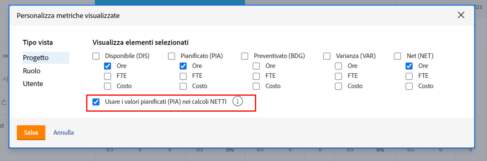
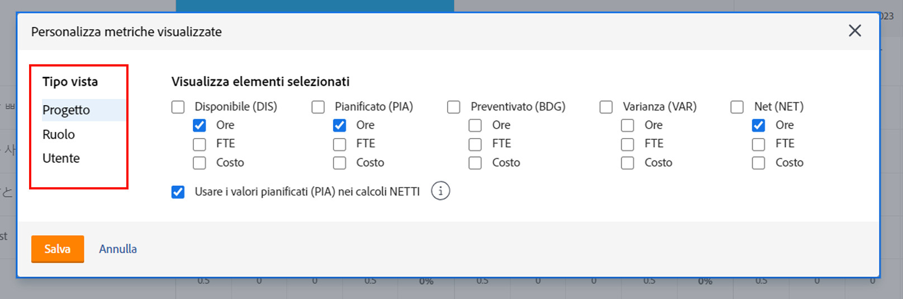
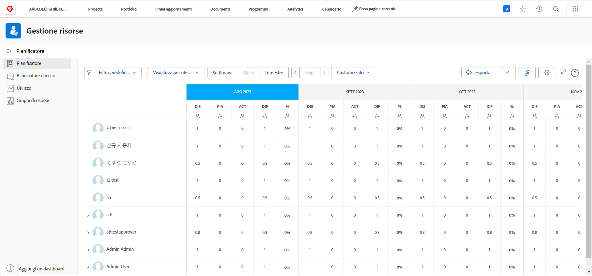

# Visualizza per progetto in [!DNL Resource Planner]

In questo video:

* Consulta [!UICONTROL Visualizza per Progetto]visualizza
* Scopri come vengono visualizzate le informazioni sulle risorse in questa visualizzazione

>[!VIDEO](https://video.tv.adobe.com/v/335170/?quality=12&learn=on)

Per impostazione predefinita, l&#39;opzione Visualizza per progetto mostra la colonna Budget, che recupera il numero stimato di risorse necessarie per un progetto da un business case, se è stata compilata. Ciò significa anche che la colonna Netto utilizza, per impostazione predefinita, i numeri della colonna Budget per indicare il numero di risorse rimanenti.

Tuttavia, l’organizzazione potrebbe non utilizzare o non essere pronta a utilizzare i casi aziendali per stimare tali importi. Puoi invece utilizzare le ore pianificate già inserite in un progetto. Tramite l&#39;opzione Personalizza è possibile scegliere quali colonne visualizzare nella vista scelta e come calcolare la colonna Netto.

Per modificare le colonne visualizzate e il calcolo della colonna Netto in modo che sia basato sulle ore pianificate:

* Fai clic sul menu a discesa Ore e seleziona Personalizza.

* Nella casella Personalizza metriche visualizzate determinare le colonne visualizzate e selezionare la casella accanto a Usa valori pianificati (PLN) nei calcoli NET.

**Nota**: per modificare le colonne e i calcoli per i diversi tipi di visualizzazione nella Programmazione delle risorse, seleziona un’opzione a sinistra della casella.

* Dopo aver fatto clic su Salva, la casella si chiude e la schermata si aggiorna.

La Programmazione delle risorse mostra ciò che è necessario sapere sulla domanda e sull&#39;offerta senza fogli di calcolo complessi e comunicazioni round robin.

Con le informazioni disponibili e gli strumenti a tua disposizione, puoi ottimizzare la capacità del team di eseguire il lavoro che ritieni importante.
