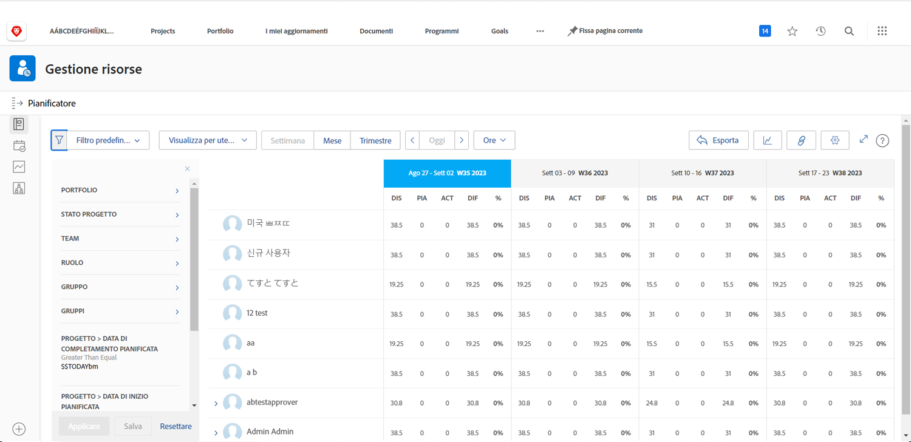

# Visualizzare l’utilizzo e filtrare la Pianificazione risorse

Con la Pianificazione risorse è possibile ottenere una visione chiara dei progetti a cui si è interessati e una panoramica in tempo reale a quanto i dipendenti siano pronti per eseguirli.

* Ad esempio, desideri sapere cosa succede alla capacità quando l’ultima iniziativa di aggiornamento del server diventa la priorità principale.

* La Pianificazione risorse mostra la disponibilità delle persone e il modo in cui l’allocazione delle risorse a un progetto influirà sulla disponibilità dei progetti con una priorità più bassa.

Sarà possibile visualizzare non solo in che modo l’allocazione delle risorse influisce sul lavoro quotidiano, ma anche al di là delle esigenze immediate della pianificazione risorse, sarà possibile valutare le allocazioni delle risorse a lungo termine per capire se i singoli utenti sono sovraccaricati (o abbiano un’allocazione ridotta).

## Filtrare la Pianificazione risorse

La Pianificazione risorse si apre automaticamente con un set predefinito di filtri. È possibile modificare tali filtri in base a:

* Arco temporale
* Portfolio/programma
* Pool di risorse, ecc.

Questo consente di concentrarsi su quali risorse sono disponibili e quando.
