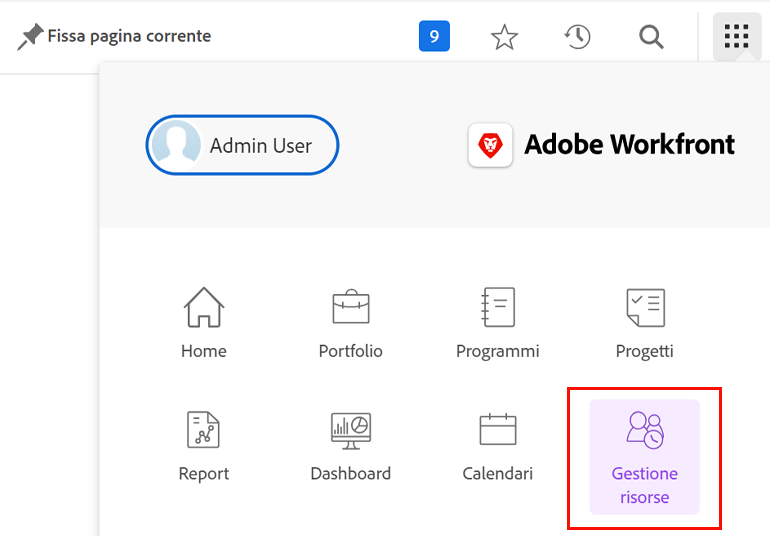
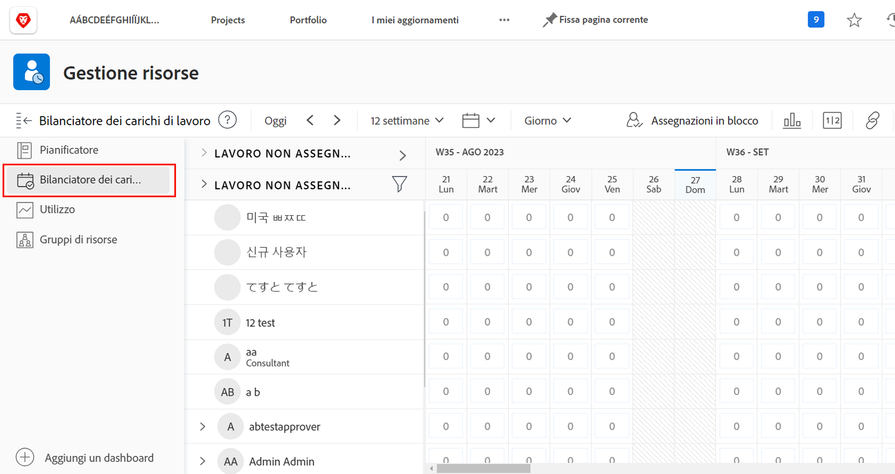
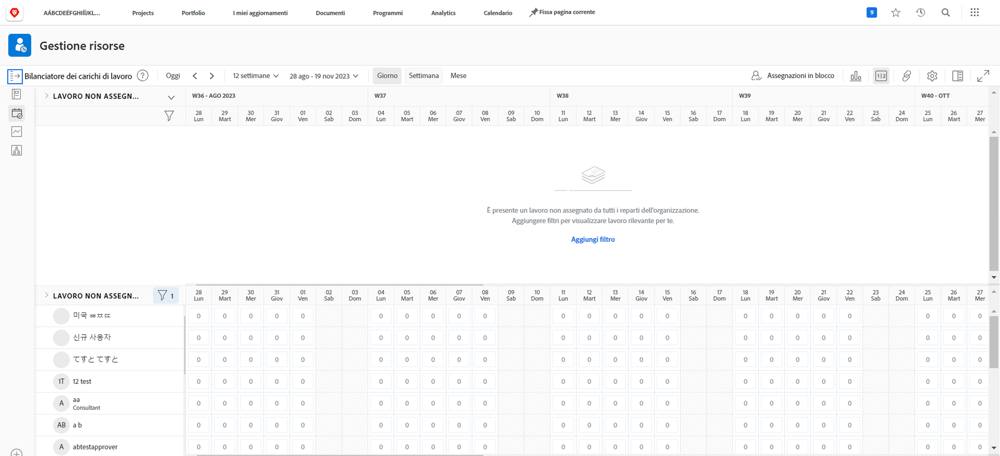
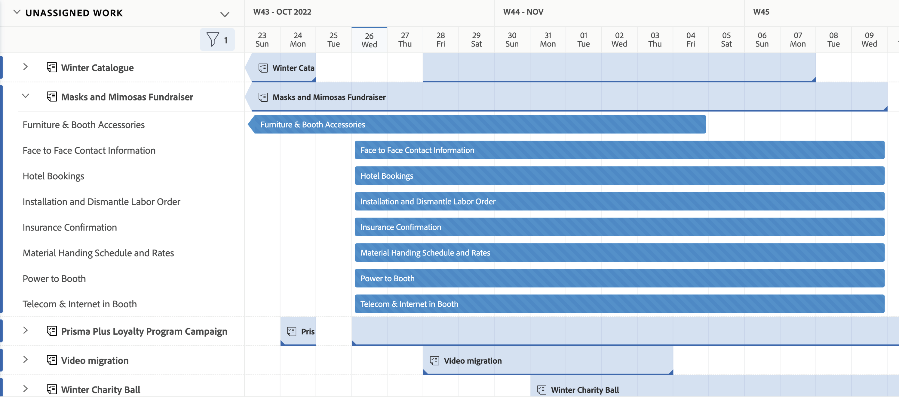

# Trova il [!DNL Workload Balancer]

Sapere quali risorse sono disponibili e come distribuirle può essere un compito impegnativo per chiunque. Ecco perché Workfront ha creato il [!DNL Workload Balancer].

Il suo scopo è quello di fornire maggiori informazioni e gestione dei carichi di lavoro giornalieri e settimanali delle persone che gestisci. Questo consente di eseguire assegnazioni migliori, in base a ruoli e disponibilità, in più progetti.

* Fai clic su [!UICONTROL Risorsa] in [!UICONTROL Menu principale].
* Vai a [!UICONTROL Bilanciamento del carico di lavoro] nell&#39;area Gestione risorse.

## Aree all’interno del servizio di bilanciamento del carico di lavoro

Due sezioni vengono visualizzate nel [!DNL Workload Balancer]: Lavoro assegnato e Lavoro non assegnato.

L’area Lavoro assegnato mostra un elenco di utenti e del lavoro a cui sono già stati assegnati in Workfront. Per impostazione predefinita, questa area viene filtrata agli utenti che fanno parte dei team Workfront a cui appartieni. In questo modo puoi vedere su quali membri del team sono stati assegnati per lavorare.

L&#39;area Lavoro non assegnato mostra il lavoro che deve ancora essere assegnato, sia a una persona, un ruolo o un team. Tuttavia, inizialmente questa area non mostrerà nulla.

Iniziando con l&#39;area Lavoro non assegnato vuota, è possibile concentrarsi sui carichi di lavoro correnti degli utenti, nell&#39;area Lavoro assegnato, prima di eseguire le assegnazioni.
