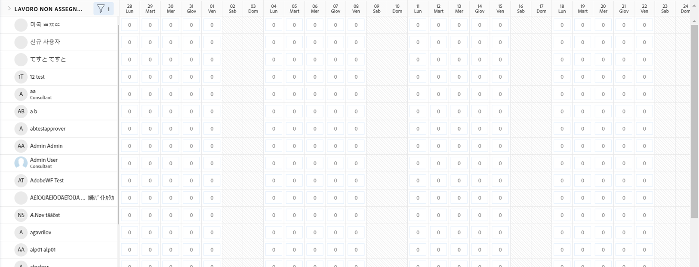
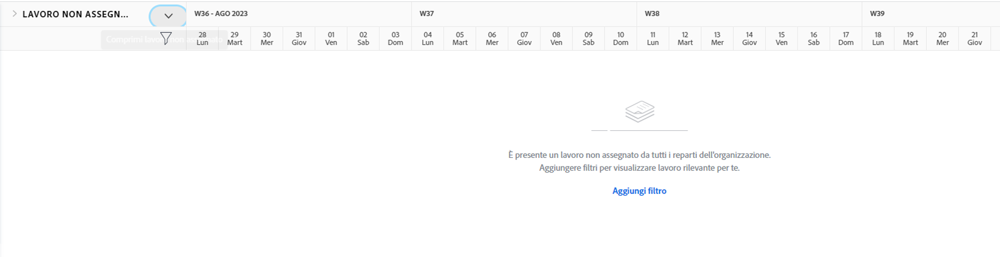

# Trova il [!DNL Workload Balancer]

Sapere quali risorse sono disponibili e come distribuirle può essere un compito impegnativo per chiunque. Ecco perché Workfront ha creato il [!DNL Workload Balancer].

Il suo scopo è fornirti una visione e una gestione più approfondite dei carichi di lavoro giornalieri e settimanali delle persone che gestisci. Questo consente di effettuare assegnazioni migliori, in base al ruolo e alla disponibilità, in più progetti.

* Clicca su [!UICONTROL Risorse] nel [!UICONTROL Menu principale].
* Passa alla sezione [!UICONTROL Pianificazione] nell’area Gestione delle risorse.
* Fai clic sulla sezione [!UICONTROL “Bilanciamento del carico di lavoro”] che viene visualizzata.

## Aree all’interno del Bilanciatore dei carichi di lavoro

Vengono visualizzate due sezioni nel [!DNL Workload Balancer]: Lavoro assegnato e Lavoro non assegnato.

L’area Lavoro assegnato mostra un elenco di utenti e il lavoro che è stato loro già assegnato all’interno di Workfront. Per impostazione predefinita, quest’area viene filtrata in base agli utenti che fanno parte dei team di Workfront a cui appartieni. In questo modo è possibile visualizzare a quali membri del gruppo è stato assegnato il lavoro.

L’area Lavoro non assegnato mostra il lavoro che deve ancora essere assegnato, a una persona, a un ruolo o a un team. Tuttavia, inizialmente quest’area non mostrerà nulla.

Iniziando con l’area di Lavoro non assegnato vuota, hai l’opportunità di concentrarti prima sui carichi di lavoro correnti degli utenti, nell’area di Lavoro assegnato, prima di effettuare le assegnazioni.
