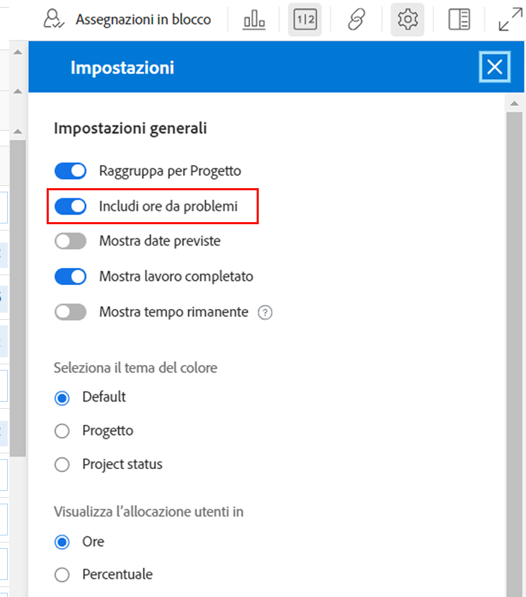
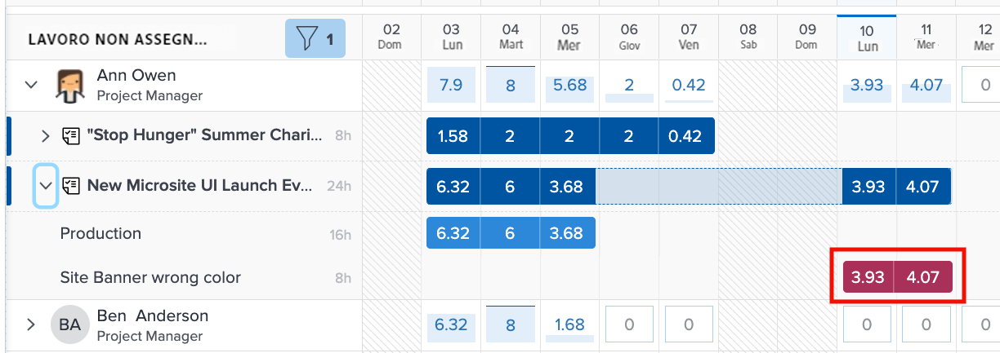
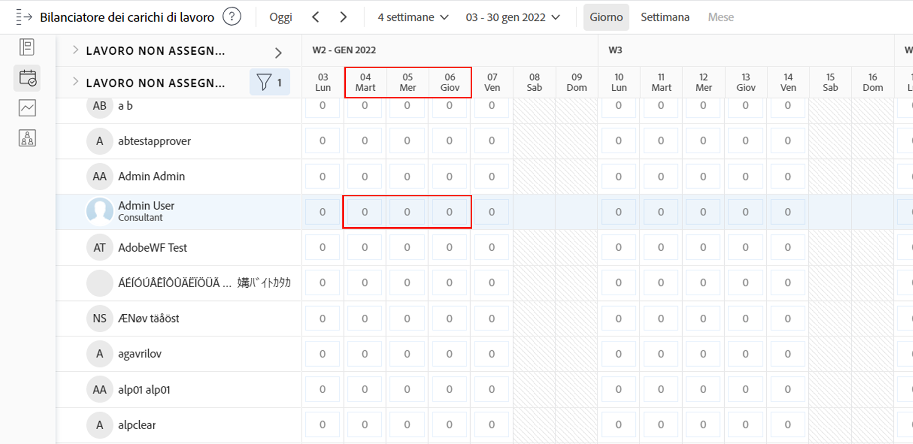
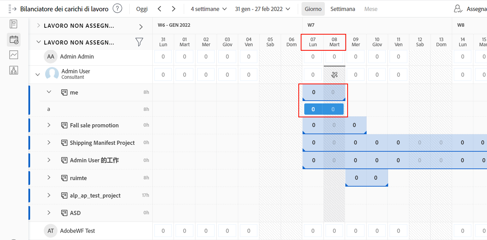
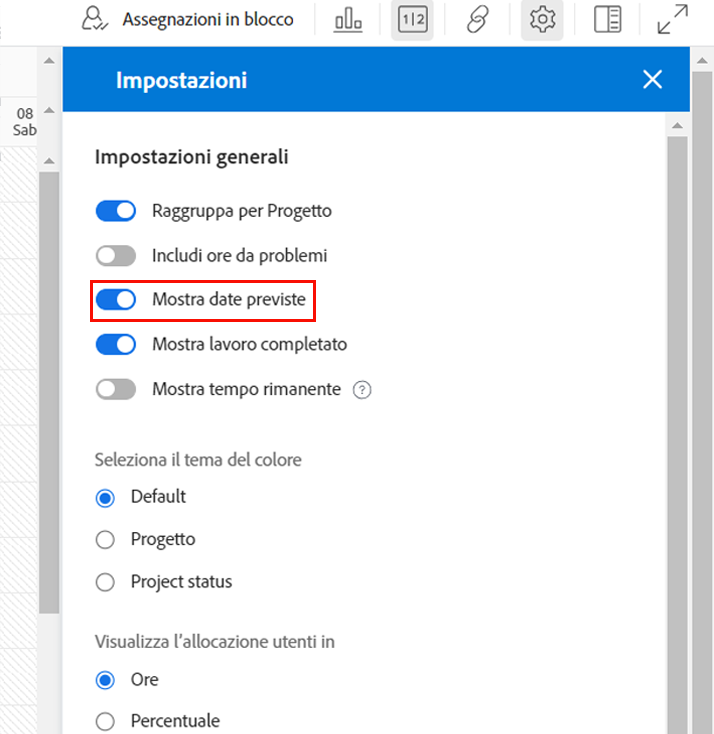
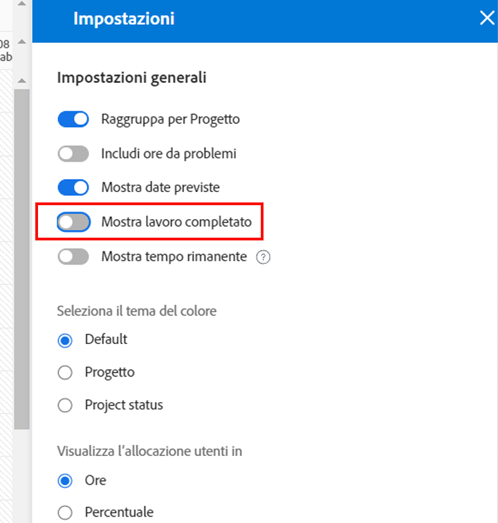

# Impostazioni da considerare per il Bilanciatore dei carichi di lavoro

Durante l’immersione nei singoli carichi di lavoro degli utenti, è necessario considerare alcune impostazioni del Bilanciatore dei carichi di lavoro:

* Assegnazioni problemi
* Date Previste
* Lavoro completato

Questi possono essere attivati o disattivati tramite l’icona Impostazioni del Bilanciatore dei carichi di lavoro.

## Includi ore da problemi

Per impostazione predefinita, il Bilanciatore dei carichi di lavoro mostra solo le attività. Tuttavia, gli utenti possono essere assegnati a richieste e problemi che devono essere evasi o risolti e che richiedono molto tempo per essere dedicati al lavoro del progetto.

Per comprendere meglio l’intero carico di lavoro di un utente, Workfront consiglia di includere i problemi nell’elenco del lavoro dell’utente assegnato.

È sufficiente selezionare l’opzione Includi ore da problemi nell’area Impostazioni del Bilanciatore dei carichi di lavoro.

Nell&#39;area Assigned Work (Lavoro assegnato) i problemi vengono visualizzati sotto forma di barre laterali leggere.

### Date progetto

Un’altra opzione disponibile tramite le impostazioni del Bilanciatore dei carichi di lavoro consiste nel mostrare i carichi di lavoro in base alle date previste.

L&#39;impostazione predefinita mostra il lavoro assegnato in base alle date pianificate inserite nel progetto.

Poiché le date previste si basano sull’avanzamento e il completamento delle attività precedenti nel progetto, è possibile ottenere una visualizzazione in tempo reale di quando un’attività inizierà o finirà, il che è particolarmente utile quando si esaminano i carichi di lavoro.

Per passare dalla visualizzazione delle date pianificate a quella prevista, utilizza l’opzione Mostra date previste nelle impostazioni del Bilanciatore dei carichi di lavoro.

### Attività completate

Le attività completate vengono visualizzate nel Bilanciatore dei carichi di lavoro insieme a quelle attualmente in corso o che stanno per iniziare. Per comprendere meglio il lavoro aggiuntivo che gli utenti possono svolgere, si consiglia di escludere il lavoro completato.

Deseleziona l’opzione Mostra lavoro completato nelle impostazioni del Bilanciatore dei carichi di lavoro.

