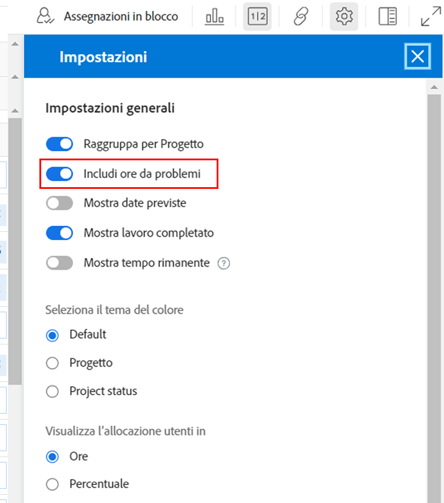
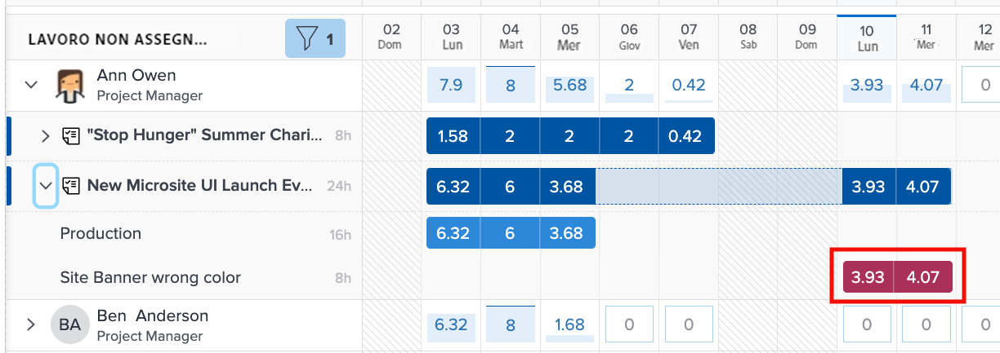
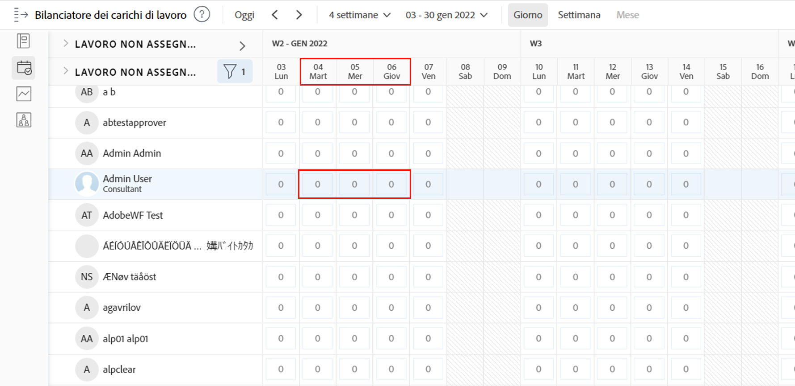
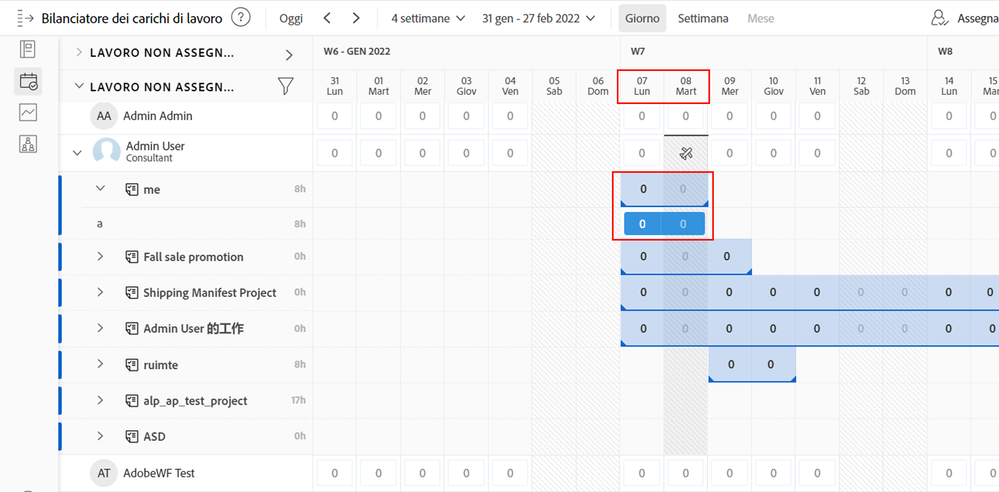
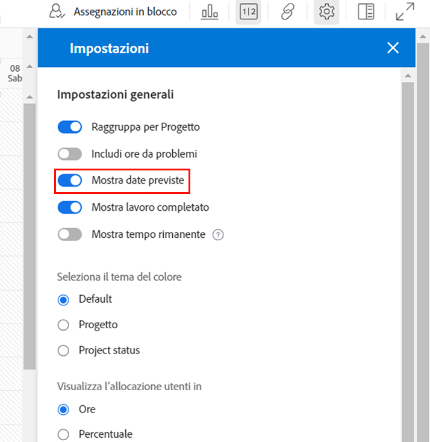
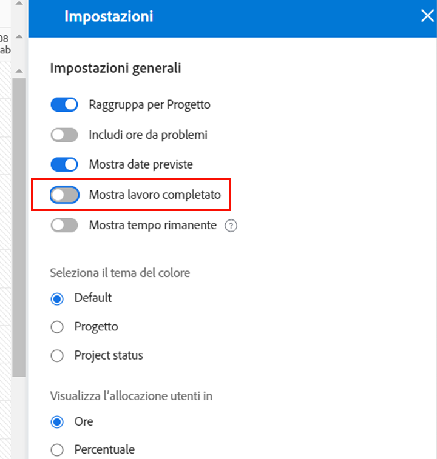

# Impostazioni da considerare per il Bilanciatore del carico di lavoro

Durante l’analisi dei singoli carichi di lavoro degli utenti, è necessario considerare alcune impostazioni del Bilanciatore del carico di lavoro:

* Assegnazioni dei problemi
* Date Previste
* Lavoro completato

Le impostazioni possono essere attivate o disattivate tramite l’icona Impostazioni del Bilanciatore del carico di lavoro.

## Includi ore da problemi

Per impostazione predefinita, il Bilanciatore del carico di lavoro mostra solo le attività. Tuttavia, gli utenti possono essere assegnati a richieste e problemi che devono essere soddisfatte o risolti e che sottraggono tempo al lavoro del progetto.

Per comprendere meglio l’intero carico di lavoro di un utente, Workfront consiglia di includere i problemi nell’elenco del lavoro dell’utente assegnato.

Basta selezionare l’opzione Includi ore da problemi nelle impostazioni del Bilanciatore del carico di lavoro.

Nell’area Lavoro assegnato, i problemi vengono visualizzati come barre di colore vinaccia chiaro.

### Date progetto

Un’altra opzione disponibile dalle impostazioni del Bilanciatore del carico di lavoro consiste nel mostrare i carichi di lavoro in base alle date previste.

L’impostazione predefinita mostra il lavoro assegnato in base alle date pianificate inserite nel progetto.

Poiché le date previste si basano sull’avanzamento e il completamento delle attività precedenti nel progetto, è possibile ottenere una visualizzazione in tempo reale di quando un’attività inizierà o finirà, il che è particolarmente utile quando si esaminano i carichi di lavoro.

Con l’opzione Mostra date previste nelle impostazioni del Bilanciatore del carico di lavoro, puoi passare dalla visualizzazione delle date pianificate a quelle previste.

### Attività completate

Le attività completate vengono visualizzate nel Bilanciatore del carico di lavoro insieme a quelle attualmente in corso o che stanno per iniziare. Per comprendere meglio il lavoro aggiuntivo che gli utenti possono svolgere, ti consigliamo di escludere il lavoro completato.

Deseleziona l’opzione Mostra lavoro completato nelle impostazioni del Bilanciatore del carico di lavoro.

