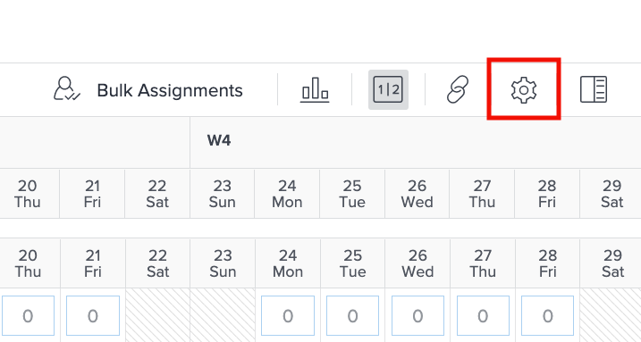

# Impostazioni da considerare per il bilanciamento del carico di lavoro

Ci sono un paio di impostazioni del servizio di bilanciamento del carico di lavoro da considerare durante l&#39;immersione nei singoli carichi di lavoro degli utenti:

* Problemi relativi alle assegnazioni
* Date Previste
* Lavoro completato

Questi possono essere attivati o disattivati tramite l&#39;icona Impostazioni di bilanciamento del carico di lavoro .

## Includi ore da problemi

Per impostazione predefinita, il servizio di bilanciamento del carico di lavoro mostra solo le attività. Tuttavia, gli utenti possono essere assegnati a richieste e problemi che devono essere soddisfatti o risolti e che possono dedicare tempo al lavoro del progetto.

Per comprendere meglio l’intero carico di lavoro di un utente, Workfront consiglia di includere i problemi nell’elenco dei lavori utente assegnati.

Seleziona l’opzione Includi ore dai problemi nell’area Impostazioni di bilanciamento del carico di lavoro .

Nell’area Lavoro assegnato, i problemi vengono visualizzati come barre laterali.

### Date progetto

Un&#39;altra opzione disponibile tramite le impostazioni del servizio di bilanciamento del carico di lavoro è quella di mostrare i carichi di lavoro in base alle date previste.

L’impostazione predefinita mostra il lavoro assegnato in base alle date pianificate inserite nel progetto.

Poiché le date previste si basano sull’avanzamento e il completamento delle attività precedenti nel progetto, è possibile visualizzare in tempo reale quando un’attività verrà avviata o terminata, il che è particolarmente utile quando si esaminano i carichi di lavoro.

È possibile passare dalla visualizzazione di date pianificate a quella proiettata con l&#39;opzione Mostra date previste nelle impostazioni di bilanciamento del carico di lavoro.

### Attività completate

Le attività completate vengono visualizzate nel servizio di bilanciamento del carico di lavoro insieme a quelle in corso o in procinto di iniziare. Per comprendere meglio cosa possono fare altri utenti del lavoro, è consigliabile escludere il lavoro completato.

Deseleziona l’opzione Mostra lavoro completato nelle impostazioni del bilanciamento del carico di lavoro.

