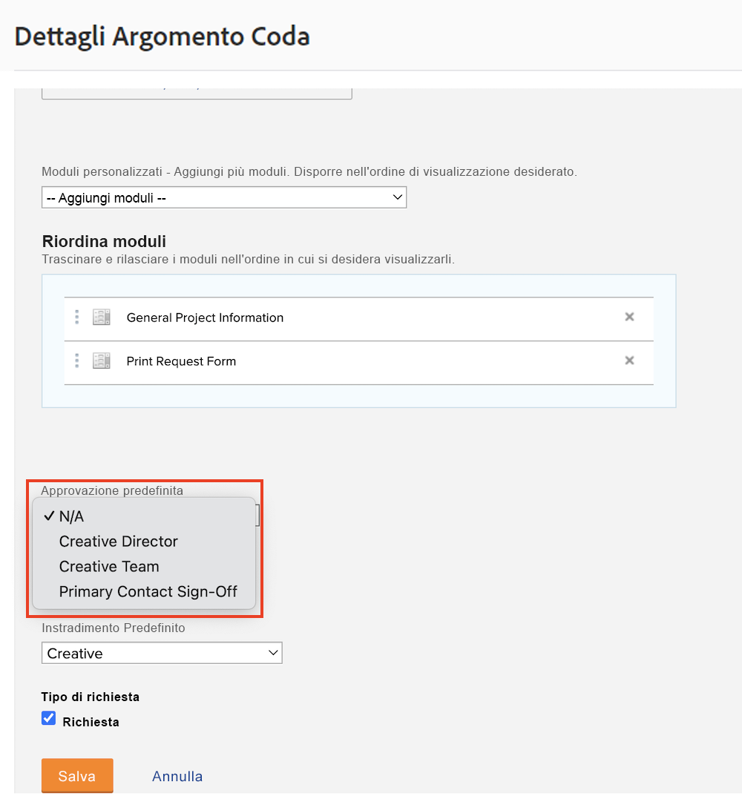
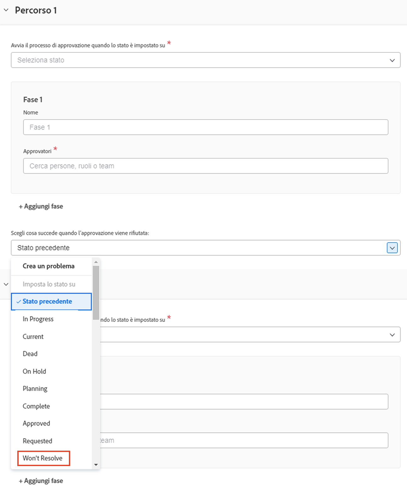

# Creare un processo di approvazione globale e monouso

I processi di approvazione su progetti, attività e problemi consentono a un project manager di ottenere la conferma da parte di esperti che il lavoro è stato svolto prima di procedere. Il project manager può creare un processo di approvazione per ogni situazione (processo di approvazione a utente singolo) o scegliere da un elenco di possibili processi di approvazione creati in precedenza per soddisfare esigenze comuni (processi di approvazione globali o esistenti).

In entrambi i casi, quando lo stato dell’oggetto cambia in quello specificato nel processo di approvazione, l’approvatore viene informato in vari modi per rivedere il lavoro e approvarlo o rifiutarlo. Dato che l’intero progetto può essere messo in pausa in attesa dell’approvazione, gli approvatori dovrebbero essere consapevoli in anticipo che potrebbero essere chiamati per un’approvazione. Se un approvatore è assente dall’incarico per qualsiasi motivo, può delegare le proprie approvazioni a un sostituto qualificato. Per maggiori informazioni, consulta [Delegare attività, problemi e approvazioni](/help/manage-work/approval-processes-and-milestone-paths/delegate-approvals.md).

Questo video illustra come creare un processo di approvazione globale e un processo di approvazione a utente singolo per un progetto, un’attività o un problema.

>[!VIDEO](https://video.tv.adobe.com/v/335225/?quality=12&learn=on)

>[!TIP]
>
>È possibile aggiungere un processo di approvazione per singolo utilizzo per un progetto o un’attività a un modello di progetto.

>[!NOTE]
>
>Puoi impostare un’approvazione per singolo utilizzo su progetti e problemi nello stesso modo descritto per le attività nel video.

## Applicare le approvazioni automatiche dei problemi in una coda di richieste

Se si desidera impostare le approvazioni automatiche dei problemi in una coda di richieste, è possibile eseguirle solo utilizzando un processo di approvazione globale dei problemi e applicarle in un [!UICONTROL argomento Coda].

Durante la creazione o la modifica di un [!UICONTROL argomento coda], selezionare il processo di approvazione globale nel campo **[!UICONTROL Approvazione predefinita]**.

Potrebbe essere necessario modificare il processo di approvazione del problema per assicurarsi che lo stato **[!UICONTROL Precedente]** non sia quello impostato per il rifiuto dell&#39;approvazione. Questo perché lo stato precedente è **[!UICONTROL Nuovo]** e questo è anche lo stato che attiva il processo di approvazione, quindi è lo stato in cui verrà impostato quando approvato. Per evitare confusione quando l&#39;approvazione del problema viene rifiutata, è meglio impostare lo stato su qualcosa come **[!UICONTROL Non risolverai]** o uno stato personalizzato creato a questo scopo.

## Tutorial consigliati su questo argomento

* [Delegare attività, problemi e approvazioni](/help/manage-work/approval-processes-and-milestone-paths/delegate-approvals.md)
* [Allegare e modificare i processi di approvazione esistenti](/help/manage-work/approval-processes-and-milestone-paths/attach-and-edit-existing-approval-processes.md)
* [Comprendere i processi di approvazione specifici del gruppo](/help/administration-and-setup/approval-processes-and-milestone-paths/group-specific-approval-processes.md)
* [Creare un flusso di richieste](/help/manage-work/request-queues/create-a-request-flow.md)

